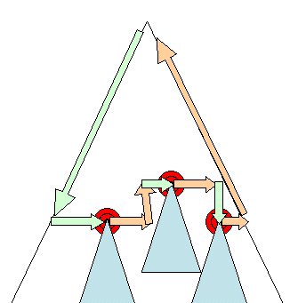
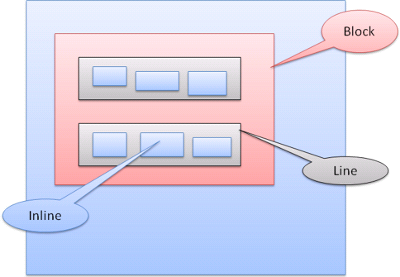
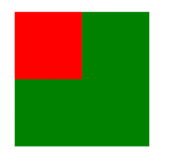

# 브라우저와 작동원리 \(3\)

### 점진적 처리

웹킷은 @import를 포함한 최상위 수준의 스타일 시트가 로드되었는지 표시하기 위해 플래그를 사용한다. DOM 노드와 시각정보를 연결하는 과정\(attaching\)에서 스타일이 완전히 로드되지 않았다면 문서에 자리 표시자를 사용하고 스타일 시트가 로드됐을 때 다시 계산한다.

### 배치

렌더러가 생성되고 트리에 추가될 때 크기\(size\)와 위치\(position\) 정보는 없다. 이 값들을 계산하는 것을 layout 또는 reflow라고 부른다.

HTML은 흐름 기반의 배치 모델을 사용하는데 이것은 보통 한 경로를 통해 크기와 위치 정보를 계산할 수 있다는 것을 의미한다. 일반적으로 "흐름 속"에서 나중에 등장하는 요소는 앞서 등장한 요소의 위치와 크기에 영향을 미치지 않기 때문에 배치는 왼쪽에서 오른쪽으로 또는 위에서 아래로 흐른다. 단, 표는 크기와 위치를 계산하기 위해 하나 이상의 경로를 필요로 하기 때문에 예외가 된다.

좌표계는 기준점으로부터 상대적으로 위치를 결정하는데 좌단\(X축\)과 상단\(Y축\) 좌표를 사용한다.

배치는 반복되며 HTML 문서의 &lt;html&gt; 요소에 해당하는 최상위 렌더러에서 시작한다. 배치는 프레임 계층의 일부 또는 전부를 통해 반복되고 각 렌더러에 필요한 크기와 위치 정보를 계산한다.

최상위 렌더러의 위치는 \(0, 0\)이고 브라우저 창의 보이는 영역에 해당하는 뷰포트 만큼의 면적을 갖는다.

모든 렌더러는 "layout" 또는 "reflow" 메서드를 갖는데 각 렌더러는 배치해야 할 자식의 배치 메소드를 불러온다.

### **Dirty Bit 체제**

사소한 변경 떄문에 전체를 다시 배치하지 않기 위해 브라우저는 "dirty bit" 체제를 사용한다. 렌더러는 다시 배치할 필요가 있는 변경 요소나 추가된 것과 그 자식을 "dirty"라고 표시한다.

"dirty"와 "children are dirty" 이렇게 두 가지 플래그가 있다. 자식이 dirty하다는 것은 본인은 괜찮지만 자식 가운데 적어도 하나를 다시 배치할 필요가 있다는 의미이다.

### **전역 배치와 점증 배치**

배치는 렌더러 트리 전체에서 일어날 수 있는데 이것을 "전역" 배치라 하고 다음과 같은 경우에 발생한다.

1. 글꼴 크기 변경과 같이 모든 렌더러에 영향을 주는 전역 스타일 변경.
2. 화면 크기 변경에 의한 결과.

배치는 더티 렌더러가 배치되는 경우에만 점증되는데 추가적인 배치가 필요하기 때문에 약간의 손실이 발생할 수 있다.

점증 배치는 렌더러가 더티일 때 비동기적으로 일어난다. 예를 들면 네트워크로부터 추가 내용을 받아서 DOM 트리에 더해진 다음 새로운 렌더러가 렌더 트리에 붙을 때이다**.**



### **비동기 배치와 동기 배치**

점증 배치는 비동기로 실행된다. 파이어폭스는 점증 배치를 위해 "리플로 명령"을 쌓아 놓고 스케줄러는 이 명령을 한꺼번에 실행한다. 웹킷도 점증 배치를 실행하는 타이머가 있는데 트리를 탐색하여 "더티" 렌더러를 배치한다.

"offsetHeight" 같은 스타일 정보를 요청하는 스크립트는 동기적으로 점증 배치를 실행한다.

전역 배치는 보통 동기적으로 실행된다.

때때로 배치는 스크롤 위치 변화와 같은 일부 속성들 때문에 초기 배치 이후 콜백으로 실행된다.

### **최적화**

배치가 "크기 변경" 또는 렌더러 위치 변화 때문에 실행되는 경우 렌더러의 크기는 다시 계산하지 않고 캐시로부터 가져온다.

어떤 경우는 하위 트리만 수정이 되고 최상위로부터 배치가 시작되지 않는 경우도 있다. 이런 경우는 입력 필드에 텍스트를 입력하는 경우와 같이 변화 범위가 한정적이어서 주변에 영향을 미치지 않을 때 발생한다. 만약 입력 필드 바깥쪽에 텍스트가 입력되는 경우라면 배치는 최상단으로부터 시작될 것이다.

### **배치 과정**

배치는 보통 다음과 같은 형태로 진행된다.

1. 부모 렌더러가 자신의 너비를 결정.
2. 부모가 자식을 검토.
   1. 자식 렌더러를 배치. \(자식의 x와 y를 설정.\)
   2. \(부모와 자식이 dirty하거나 전역 배치 상태이거나 또는 다른 이유로\) 필요하다면 자식 배치를 호출하여 자식의 높이를 계산.
3. 부모는 자식의 누적된 높이와 여백, 패딩을 사용하여 자신의 높이를 설정. 이 값은 부모 렌더러의 부모가 사용하게 됨.
4. dirty bit 플래그를 제거.

파이어폭스는 "상태" 객체\(nsHTMLReflowState\)를 배치\("reflow"를 의미.\)를 위한 매개 변수로 사용하는데 상태는 부모의 너비를 포함한다.

파이어폭스 배치의 결과는 "매트릭스" 객체\(nsHTMLReflowMatrics\)인데 높이가 계산된 렌더러를 포함한다.

### **너비 계산**

렌더러의 너비는 포함하는 블록의 너비, 그리고 렌더러의 너비와 여백, 테두리를 이용하여 계산된다.


```markup
<div style="width:30%"></div>  
```


웹킷은 다음\(RenderBox 클래스의 calcWidth 메서드\)과 같이 계산할 것이다.

* 컨테이너의 너비는 컨테이너 availableWidth와 0 사이의 최대값이다. 이 경우 availableWidth는 다음과 같이 계산된 contentWidth이다.
  * clientWidth\(\)-paddingLeft\(\)-paddingRight\(\)
  * clientWidth와 clientHeight는 객체의 테두리와 스크롤바를 제외한 내부 영역을 의미한다.
* 요소의 너비는 "width" 스타일 속성의 값이다. 이 컨테이너 너비의 백분율 값은 절대 값으로 변환될 것이다.
* 좌우측 테두리와 패딩 값이 추가된다.

여기까지 "우선 너비"의 계산이었다. 이제는 최소 너비와 최대 너비가 계산될 것이다.

우선 너비가 최대 너비보다 크면 최대 너비가 사용된다. 우선 너비가 최소 너비보다 작으면 최소 너비가 사용된다.

값들은 배치가 필요할 때를 대비해 캐시되지만 너비는 변경되지 않는다.

### **줄바꿈**

렌더러가 배치되는 동안 줄을 바꿀 필요가 있을 때 배치는 중단되고 줄을 바꿀 필요가 있음을 부모에게 전달한다. 부모는 추가 렌더러를 생성하고 배치를 호출한다.

### **그리기**

그리기 단계에서는 화면에 내용을 표시하기 위한 렌더 트리가 탐색되고 렌더러의 "paint" 메서드가 호출된다. 그리기는 UI 기반의 구성 요소를 사용한다.

### **전역과 점증**

그리기는 배치와 마찬가지로 전역 또는 점증 방식으로 수행된다. 점증 그리기에서 일부 렌더러는 전체 트리에 영향을 주지 않는 방식으로 변경된다.

1. 변경된 렌더러는 화면 위의 사각형을 무효화\(invalidates\)한다.
2. OS는 이것을 "dirty 영역"으로 보고 "paint" 이벤트를 발생시킨다.
3. OS는 효과적으로 수행하여 여러 개의 영역을 하나로 합친다.

크롬에서는 렌더러가 주 프로세스와 다른 프로세스에 있기 때문에 더 복잡하다. 크롬은 OS의 동작을 어느정도 모방한다. 프레젠테이션은 이벤트를 듣고 렌더 루트에게 이벤트를 전파한다. 적절한 렌더러에 이를 때까지 트리는 탐색되고 스스로\(보통 자식과 함께\) 그려진다.

### **그리기 순서**

[CSS 2는 그리기 과정의 순서를정의했다](http://www.w3.org/TR/CSS21/zindex.html). 이것은 실제로 요소가 stacking contexts에 쌓이는 순서다. 스택은 뒤에서 앞으로 그려지기 때문에 이 순서는 그리기에 영향을 미친다. 블록 렌더러가 쌓이는 순서는 다음과 같다.

1. 배경 색
2. 배경 이미지
3. 테두리
4. 자식
5. 아웃라인

### 파이어폭스 표시 목록

파이어폭스는 렌더 트리를 검토하고 그려진 사각형을 위한 표시 목록을 구성한다. 목록은 올바른 그리기 순서\(배경, 테두리, 기타……\)에 따라 사각형을 위한 적절한 렌더러를 포함한다. 이런 방법으로 트리는 여러 번 리페인팅을 실행하는 대신 한 번만 탐색하면서 배경 색, 배경 이미지, 테두리 그리고 나머지 순으로 그려낸다.

파이어폭스는 다른 불투명 요소 뒤에 완전히 가려진 요소는 추가하지 않는 방법으로 최적화를 진행한다.

### 웹킷 사각형 저장소

리페인팅 전에 웹킷은 기존의 사각형을 비트맵으로 저장하여 새로운 사각형과 비교하고 차이가 있는 부분만 다시 그린다.

### 동적 변경

브라우저는 변경에 대해 가능한 한 최소한의 동작으로 반응하려고 노력한다. 그렇기 때문에 요소의 색깔이 바뀌면 해당 요소의 리페인팅만 발생한다. 요소의 위치가 바뀌면 요소와 자식 그리고 형제의 리페인팅과 재배치가 발생한다. DOM 노드를 추가하면 노드의 리페인팅과 재 배치가 발생한다. "html" 요소의 글꼴 크기를 변경하는 것과 같은 큰 변경은 캐시를 무효화하고 트리 전체의 배치와 리페인팅이 발생한다.

### 렌더링 엔진의 스레드

렌더링 엔진은 통신을 제외한 거의 모든 경우에 단일 스레드로 동작한다. 파이어폭스와 사파리의 경우 렌더링 엔진의 스레드는 브라우저의 주요한 스레드에 해당한다. 크롬에서는 이것이 탭 프로세스의 주요 스레드이다.

통신은 몇 개의 병렬 스레드에 의해 진행될 수 있는데 병렬 연결의 수는 보통 2개에서 6개로 제한된다\(예를 들면 파이어폭스 3은 6개를 사용\).

### 이벤트 순환

브라우저의 주요 스레드는 이벤트 순환으로 처리 과정을 유지하기 위해 무한 순환된다. 배치와 그리기 같은 이벤트를 위해 대기하고 이벤트를 처리한다. 아래는 주요 이벤트 순환을 위한 파이어폭스 코드이다.

### CSS2 시각 모델

#### 1\) 위치 결정 방법

위치를 결정하는 방법은 세 가지다.

1. Normal - 객체는 문서 안의 자리에 따라 위치가 결정된다. 이것은 렌더 트리에서 객체의 자리가 DOM 트리의 자리와 같고 박스 유형과 면적에 따라 배치됨을 의미한다.
2. Float - 객체는 우선 일반적인 흐름에 따라 배치된 다음 왼쪽이나 오른쪽으로 흘러 이동한다.
3. Absolute - 객체는 DOM 트리 자리와는 다른 렌더 트리에 놓인다.

위치는 "position" 속성과 "float" 속성에 의해 결정된다.

* static과 relative로 설정하면 일반적인 흐름에 따라 위치가 결정된다.
* absolute와 fixed로 설정하면 절대적인 위치가 된다.

position 속성을 정의하지 않으면 static이 기본 값이 되며 일반적인 흐름에 따라 위치가 결정된다. static 아닌 다른 속성 값\(relative, absolute, fixed\)를 사용하면 top, bottom, left, right 속성으로 위치를 결정할 수 있다.

박스가 배치되는 방법은 다음과 같은 방법으로 결정된다.

* 박스 유형 \(display, inline ...\)
* 박스 크기 \(width, height ...\)
* 위치 결정 방법 \(position, float\)
* 추가적인 정보 \(이미지 크기와 화면 크기 등.\)

#### 2\) 박스 유형

####  ① block box 

#### 브라우저 창에서 사각형 블록을 형성, 블록은 다른 블록 아래 수직으로 배치된다.

#### ② inline box 

#### 블록이 되지 않고 블록 내부에 포함, 인라인은 수평으로 배치된다.

인라인 박스는 라인 또는 "라인 박스" 안쪽에 놓인다. 라인은 적어도 가장 큰 박스만큼 크지만 "baseline" 정렬일 때 더 커질 수 있다. 이것은 요소의 하단이 다른 상자의 하단이 아닌 곳에 배치된 경우를 의미한다. 포함하는 너비가 충분하지 않으면 인라인은 몇줄의 라인으로 배치되는데 이것은 보통 문단에서 발생한다.



#### 3\) 위치 잡기

#### ① 상대적인 위치 

####  일반적인 흐름에 따라 위치를 결정한 다음 필요한 만큼 이

#### ② 플로트 

####  왼쪽  또는 오른쪽으로 이동한다. 다른 박스가  이 주변을 흐른다.

#### ③ 절대 위치\(absolute\)와 고정 위치\(fixed\)

절대 위치와 고정 위치는 일반적인 흐름과 무관하게 결정되고, 일반적인 흐름에 관여하지 않으며, 면적은 부모에 따라 상대적이다. 고정 위치의 경우 뷰포트로부터 위치를 결정한다.

#### 4\) 층 표현

이것은 CSS의 z-index 속성에 의해 명시된다. 층은 박스의 3차원 표현이고 "z 축"을 따라 위치를 정한다.

박스는 \(stacking contexts라고 부르는\) 스택으로 구분된다. 각 스택에서 뒤쪽 요소가 먼저 그려지고 앞쪽 요소는 사용자에게 가까운 쪽으로 나중에 그려진다. 가장 앞쪽에 위치한 요소는 겹치는 이전 요소를 가린다.

스택은 z-index 속성에 따라 순서를 결정한다. z-index 속성이 있는 박스는 지역 스택\(local stack\)을 형성한다. 뷰포트는 바깥쪽의 스택\(outer stack\)이다.

```markup
<style type="text/css">  
div {  
    position: absolute;
    left: 2in;
    top: 2in;
}
</style>  
<p>  
    <div style="z-index:3;background-color:red;width:1in;height:1in"></div>
    <div style="z-index:1;background-color:green;width:2in;height:2in"></div>
</p>  
```



붉은색 박스가 초록색 박스보다 마크업에서 먼저 나오기 때문에 일반적인 흐름이라면 먼저 그려져야 하지만 z-index 속성이 높기 때문에 더 앞쪽에 표시된다.

