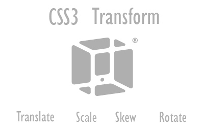

# CSS 2D transform

### 1. 2D transform



CSS3에서 추가된 `transform` 속성을 사용하여 요소의 모양, 크기, 위치 등을 자유롭게 바꿀 수 있다. `transform` 속성에서 사용되는 x, y, z 좌표가 있지만 **2D transform은 x축/y축에 대해서만 변형한다.** 

#### 1\) 2D transform method

 2D transform에 제공되는 메서드\(method\)는 아래와 같다.

* `translateX(x), translateY(y), translate(x, y)`
* `roateX(x), rotateY(y), rotate(x, y)`
* `scaleX(x), scaleY(y), scale(x, y)`
* `skewX(x), skewY(y)`
* `matrix()`

#### 2\) translate\(\)

`translate()`메서드는 현재 위치에서 해당 요소를 주어진 x축과 y축의 거리만큼 이동시킨다. 주어진 거리가 양수이면 해당 축의 양의 방향으로, 음수이면 해당 축의 음의 방향으로 이동시킨다.

#### 3\) rotate\(\)

`roate()`메서드는 해당 요소를 주어진 각도만큼 시계 방향이나 반시계 방향으로 회전 시킨다. 주어진 각도가 양수이면 시계 방향으로, 음수이면 반시계 방향으로 회전시킨다.

#### 4\) scale\(\)

`scale()`메서드는 해당 요소의 크기를 주어진 배율만큼 늘리거나 줄인다. 주어진 배율이 1보다 크면 크기를 늘리고, 0 보다 크고 1 보다 작으면 크기를 줄인다.

#### 5\) skew\(\)

`skew()`메서드는 해당 요소를 주어진 각도만큼  x축과 y축 방향으로 기울인다. 

#### 6\) matrix\(\)

`matrix()`메서드는 모든 2D transform  메서드를 한 줄에 설정할 수 있도록 해준다. 이 메서드는 **2D transform과 관련된 6개의 매개변수를 가진다.** 

```css
matrix(scaleX(), skewY(), skewX(), scaleY(), translateX(), translateY());
```

#### Reference

transform [→\(MDN\)](https://developer.mozilla.org/en-US/docs/Web/CSS/transform)

#### Result

💻2D transform property [→\(CODEPEN\)](https://codepen.io/vi2920va/full/NWRJyOW)


