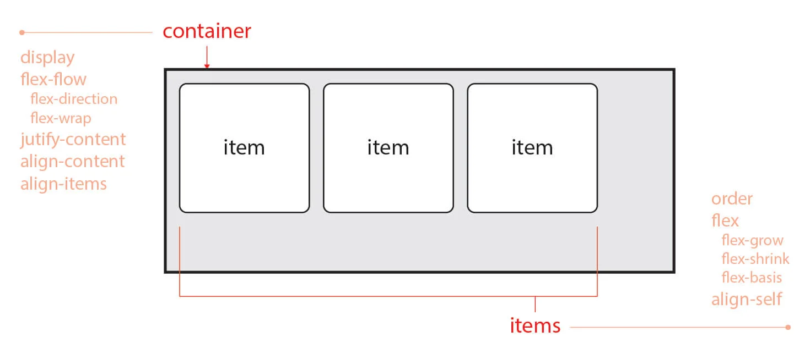
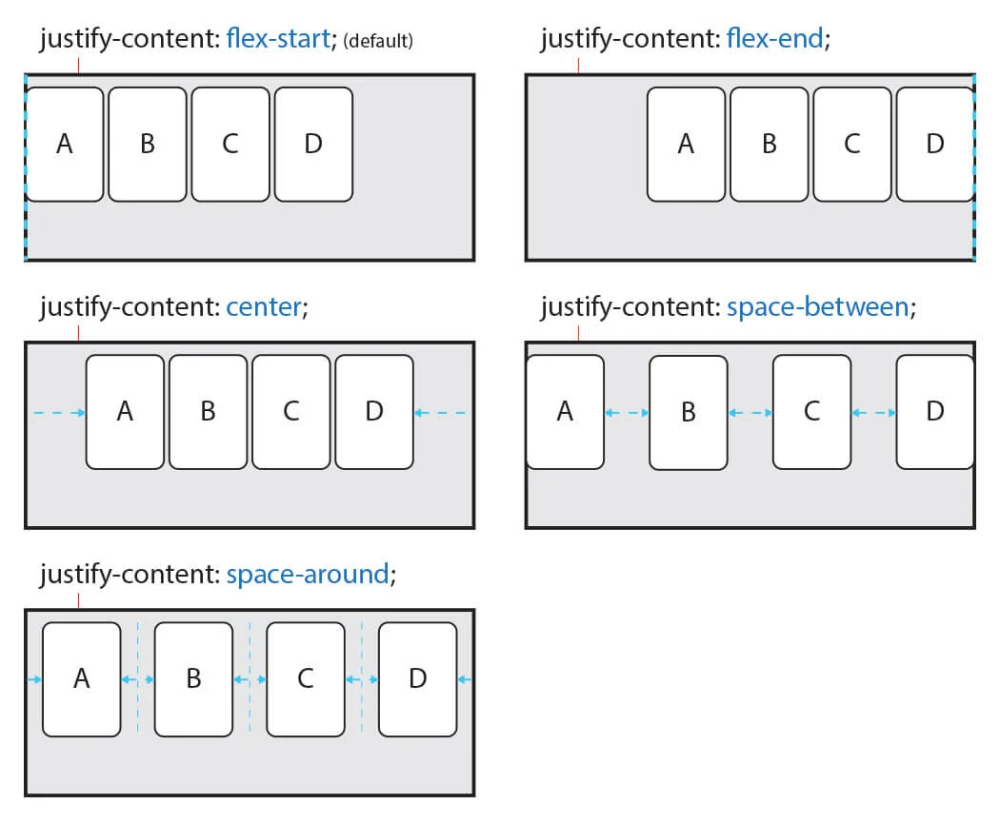
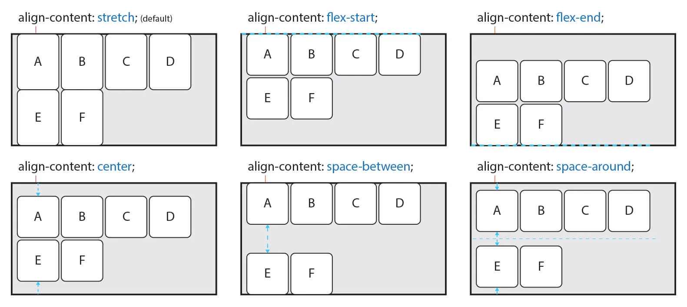
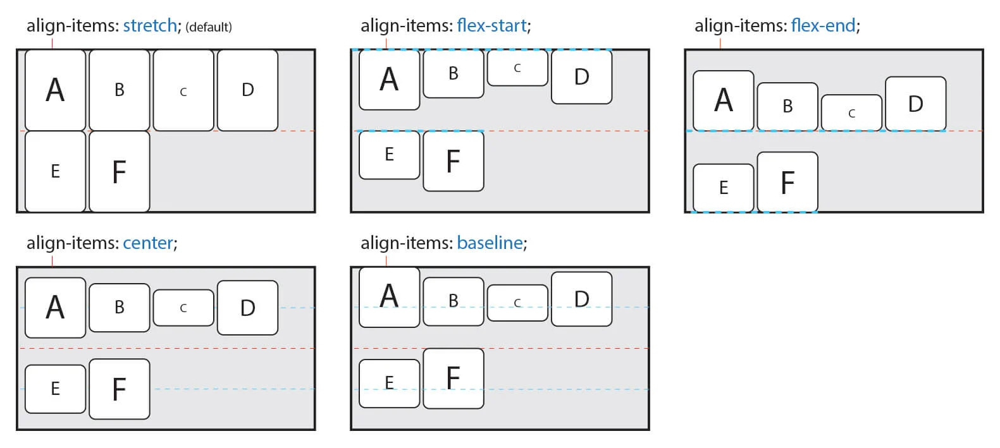

# 플렉시블 레이아웃 1

### 1. FlEXBOX

**flexbox**는 뷰포트나 요소의 크기가 불명확하거나 동적으로 변할 때에도 효율적으로 요소를 배치, 정렬, 분산할 수 있는 방법을 제공하는 CSS3의 **새로운 레이아웃 방식**이다.

### 2. flex **container**

**flex**는 **container**와 **items**두 가지 개념으로 나뉜다. **container**는 **items**를 감싸는 부모 요소이며, 각 **items**을 정렬하기 위해선 **container**가 필수이다.

#### 1\) display

`display` 속성은 flex container를 설정하는 속성이다. block 이나 lnline이 아닌 `flex` ,`inline-flex`를 사용한다.

| value | description |
| :--- | :--- |
| `flex` | 속성 값이 `flex` 이면, block 요소와 같은 성향의 **수직 쌓임**을 가진다. |
| `inline-flex` | 속성 값이 `inline-flex`이면, inline-block 요소와 같은 성향의 **수평 쌓임**을 가진다. |

#### 2\)  flex-flow

`flex-flow` 속성은 `flex-direction`, `flex-wrap`의 속성을 축약해서 `flex-flow`로 표현한다.

즉, flex item 의 주 축 \(main axis\)를 설정 하고, flex items를 여러 줄 바꿈도 설정한다.

#### 3\)  flex-direction

`flex-direction` 속성은 flex items 주 축\(main axis\)를 설정하는 속성이다.

<table>
  <thead>
    <tr>
      <th style="text-align:left">value</th>
      <th style="text-align:left">description</th>
    </tr>
  </thead>
  <tbody>
    <tr>
      <td style="text-align:left"><code>row</code>(defalut)</td>
      <td style="text-align:left">&#xC18D;&#xC131; &#xAC12;&#xC774; <code>row</code> &#xC774;&#xBA74; flex
        items&#xB97C; &#xC218;&#xD3C9;&#xCD95; (&#xC67C;&#xCABD;&#xC5D0;&#xC11C;
        &#xC624;&#xB978;&#xCABD;&#xC73C;&#xB85C;) &#xD45C;&#xC2DC;&#xB41C;&#xB2E4;.</td>
    </tr>
    <tr>
      <td style="text-align:left"><code>row-reverse</code>
      </td>
      <td style="text-align:left">
        
&#xC18D;&#xC131; &#xAC12;&#xC774; <code>row-reverse</code> &#xC774;&#xBA74;
          flex item&#xB97C; <code>row</code>&#xC758; &#xBC18;&#xB300;&#xCD95;(&#xC624;&#xB978;&#xCABD;&#xC5D0;&#xC11C;
          &#xC67C;&#xCABD;&#xC73C;&#xB85C;)

        
&#xD45C;&#xC2DC;&#xD55C;&#xB2E4;.

      </td>
    </tr>
    <tr>
      <td style="text-align:left"><code>column</code>
      </td>
      <td style="text-align:left">&#xC18D;&#xC131; &#xAC12;&#xC774; <code>column</code> &#xC774;&#xBA74; flex
        item&#xB97C; &#xC218;&#xC9C1;&#xCD95;(&#xC704;&#xC5D0;&#xC11C; &#xC544;&#xB798;&#xB85C;)&#xC73C;&#xB85C;
        &#xD45C;&#xC2DC;&#xB41C;&#xB2E4;.</td>
    </tr>
    <tr>
      <td style="text-align:left"><code>column-reverse</code>
      </td>
      <td style="text-align:left">&#xC18D;&#xC131; &#xAC12;&#xC774; <code>column-reverse</code>&#xC774;&#xBA74;
        flex item&#xB97C; &#xBC18;&#xB300;&#xCD95;(&#xC544;&#xB798;&#xC11C; &#xC704;&#xB85C;)&#xC73C;&#xB85C;
        &#xD45C;&#xC2DC;&#xB41C;&#xB2E4;.</td>
    </tr>
  </tbody>
</table>

#### 4\)  **flex-wrap**

`flex-wrap`속성은 flex items를 여러 줄 묶음\(줄 바꿈\)을 설정하는 속성이다.

`nowrap`, `wrap`, `wrap-reverse` 를 속성 값에 사용한다.

| value | description |
| :--- | :--- |
| `nowrap`\(defalut\) | 속성 값이 `nowrap`이면, 모든 flex item를 여러 줄로 묶지 않고 한 줄로 표시된다.  |
| `wrap` | 속성 값이 `wrap` 이면, flex item를 여러 줄로 묶어서 표시된다. |
| `wrap-reverse` | flex item를 `wrap`의 역 방향으로  여러 줄로 묶어서 표시된다. |

#### 5\) justify-content

 `justify-content` 속성은 주축을 기준으로 flex item을 수평으로 정렬한다.

<table>
  <thead>
    <tr>
      <th style="text-align:left">value</th>
      <th style="text-align:left">description</th>
    </tr>
  </thead>
  <tbody>
    <tr>
      <td style="text-align:left"><code>flex-start</code>(defalut)</td>
      <td style="text-align:left">&#xC8FC; &#xCD95;&#xC758; &#xC2DC;&#xC791; &#xBD80;&#xBD84;&#xC744; &#xAE30;&#xC900;&#xC73C;&#xB85C;
        flex item&#xB97C; &#xC815;&#xB82C;&#xD55C;&#xB2E4;.</td>
    </tr>
    <tr>
      <td style="text-align:left"><code>center</code>
      </td>
      <td style="text-align:left">&#xC8FC; &#xCD95;&#xC758; &#xC911;&#xC559;&#xC744; &#xAE30;&#xC900;&#xC73C;&#xB85C;
        flex item&#xB97C; &#xC815;&#xB82C;&#xD55C;&#xB2E4;.</td>
    </tr>
    <tr>
      <td style="text-align:left"><code>flex-end</code>
      </td>
      <td style="text-align:left">&#xC8FC; &#xCD95;&#xC758; &#xB05D; &#xBD80;&#xBD84;&#xC73C;&#xB85C; flex
        item&#xB97C; &#xC815;&#xB82C;&#xD55C;&#xB2E4;.</td>
    </tr>
    <tr>
      <td style="text-align:left"><code>space-around</code>
      </td>
      <td style="text-align:left">&#xC8FC; &#xCD95;&#xC758; &#xAE30;&#xC900;&#xC73C;&#xB85C; flex item &#xC77C;&#xC815;&#xD55C;
        &#xAC04;&#xACA9;&#xC73C;&#xB85C; &#xC815;&#xB82C;&#xD55C;&#xB2E4;.</td>
    </tr>
    <tr>
      <td style="text-align:left"><code>space-between</code>
      </td>
      <td style="text-align:left">
        
&#xCCAB; &#xBC88;&#xC9F8;&#xC640; &#xB9C8;&#xC9C0;&#xB9C9; flex item&#xC740;
          &#xC8FC; &#xCD95;&#xC758; &#xC2DC;&#xC791; &#xBD80;&#xBD84;&#xACFC; &#xB05D;
          &#xBD80;&#xBD84;&#xC5D0; &#xC815;&#xB82C;&#xD558;&#xACE0;,

        
&#xB098;&#xBA38;&#xC9C0;&#xB294; flex item&#xC744; &#xC77C;&#xC815;&#xD55C;
          &#xAC04;&#xACA9;&#xC73C;&#xB85C; &#xC815;&#xB82C;&#xD55C;&#xB2E4;.

      </td>
    </tr>
  </tbody>
</table>

#### 6\) align-content

 `align-content` 속성은 flex item이 **여러 줄\(2 줄 이상 이고 여백이 있을 경우\)**로 나열되어 있을 때 주축을 기준으로 수직 정렬 방법을 설정하는 속성이다. 

<table>
  <thead>
    <tr>
      <th style="text-align:left">value</th>
      <th style="text-align:left">description</th>
    </tr>
  </thead>
  <tbody>
    <tr>
      <td style="text-align:left"><code>stretch </code>(defalut)</td>
      <td style="text-align:left">flex item&#xC758; &#xB192;&#xC774;&#xB97C; &#xB298;&#xB824;, flex container&#xC758;
        &#xC804;&#xCCB4; &#xB192;&#xC774;&#xB97C; &#xCC44;&#xC6B4;&#xB2E4;.</td>
    </tr>
    <tr>
      <td style="text-align:left"><code>flex-start</code>
      </td>
      <td style="text-align:left">&#xAD50;&#xCC28;&#xCD95;&#xC758; &#xC2DC;&#xC791; &#xBD80;&#xBD84;&#xC744;
        &#xAE30;&#xC900;&#xC73C;&#xB85C; &#xC815;&#xB82C;&#xD55C;&#xB2E4;.</td>
    </tr>
    <tr>
      <td style="text-align:left"><code>flex-end</code>
      </td>
      <td style="text-align:left">&#xAD50;&#xCC28;&#xCD95;&#xC758; &#xB05D;&#xBD80;&#xBD84;&#xC744; &#xAE30;&#xC900;&#xC73C;&#xB85C;
        &#xC815;&#xB82C;&#xD55C;&#xB2E4;.</td>
    </tr>
    <tr>
      <td style="text-align:left"><code>center</code>
      </td>
      <td style="text-align:left">&#xAD50;&#xCC28;&#xCD95;&#xC758; &#xC911;&#xC559;&#xC744; &#xAE30;&#xC900;&#xC73C;&#xB85C;
        &#xC815;&#xB82C;&#xD55C;&#xB2E4;.</td>
    </tr>
    <tr>
      <td style="text-align:left"><code>space-between</code>
      </td>
      <td style="text-align:left">
        
&#xCCAB; &#xBC88;&#xC9F8;&#xC640; &#xB9C8;&#xC9C0;&#xB9C9; flex item&#xC740;
          &#xAD50;&#xCC28;&#xCD95;&#xC758; &#xC2DC;&#xC791; &#xBD80;&#xBD84;&#xACFC;
          &#xB05D;&#xBD80;&#xBD84;&#xC5D0; &#xC815;&#xB82C;&#xD558;&#xACE0;

        
&#xB098;&#xBA38;&#xC9C0; flex item&#xC744; &#xC77C;&#xC815;&#xD55C; &#xAC04;&#xACA9;&#xC73C;&#xB85C;
          &#xC815;&#xB82C;&#xD55C;&#xB2E4;.

      </td>
    </tr>
    <tr>
      <td style="text-align:left"><code>space-around</code>
      </td>
      <td style="text-align:left">&#xAD50;&#xCC28;&#xCD95;&#xC744; &#xAE30;&#xC900;&#xC73C;&#xB85C; flex
        item&#xC744; &#xC77C;&#xC815;&#xD55C; &#xAC04;&#xACA9;&#xC73C;&#xB85C;
        &#xC815;&#xB82C;&#xD55C;&#xB2E4;.</td>
    </tr>
  </tbody>
</table>

#### 7\) align-items

 `align-items` 속성은 주축을 기준으로 flex item을 수직으로 정렬한다. 교차축 기준으로 수직 정렬 방법을 설정하는 속성이다. flex item의 **한 줄 일 경우** 많이 사용한다.

| value | description |
| :--- | :--- |
| `stretch` \(defalut\) | flex item의 높이를 늘려, flex container의 전체 높이를 채운다. |
| `flex-start` | 교차축의 시작 부분을 기준으로 flex item 정렬한다. |
| `flex-end` | 교차축의 끝부분을 기준으로 flex item을 정렬한다. |
| `center` | 교차축의 중앙을 기준으로 flex item 정렬한다. |
| `baseline` | 글꼴의 기준선인 baseline을 기준으로 flex item을 정렬한다. |

#### Reference

A Complete Guide to Flexbox [→\(CSS-TRICKS\)](https://css-tricks.com/snippets/css/a-guide-to-flexbox/)

CSS flexible 레이아웃: flex item의 팽창과 수축. [→\(SITE\)](https://naradesign.github.io/article/)

Typical use cases of Flexbox [→\(MDN\)](https://developer.mozilla.org/en-US/docs/Web/CSS/CSS_Flexible_Box_Layout/Typical_Use_Cases_of_Flexbox)

Flexbox 이해: 당신이 알아야 할 모든 것 \(Understanding Flexbox: Everything you need to know\) [→\(SITE\)](https://www.vobour.com/4-flexbox-%EC%9D%B4%ED%95%B4-%EB%8B%B9%EC%8B%A0%EC%9D%B4-%EC%95%8C%EC%95%84%EC%95%BC-%ED%95%A0-%EB%AA%A8%EB%93%A0-%EA%B2%83-understa)

Flex 완벽 가이드 →[ \(SITE\)](https://heropy.blog/2018/11/24/css-flexible-box/)

flexbox로 만들 수 있는 10가지 레이아웃 [→ \(NAVER\)](https://d2.naver.com/helloworld/8540176)

플렉스 박스 레이아웃 [→\(SITE\)](https://poiemaweb.com/css3-flexbox)

Flex 지원 범위 [→\(Can I Use\)](https://caniuse.com/#search=flexbox)

