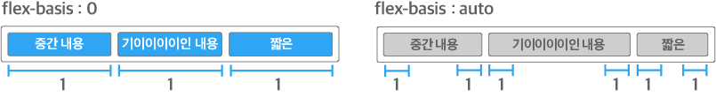
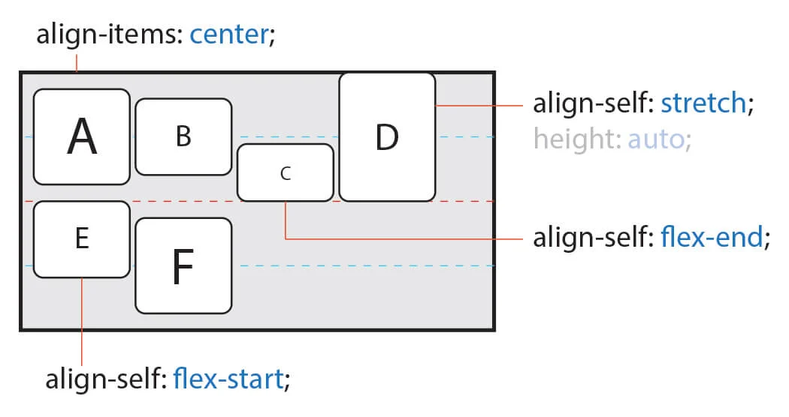

# 플렉시블 레이아웃 2

### 1. FlEXBOX

**flexbox**는 뷰포트나 요소의 크기가 불명확하거나 동적으로 변할 때에도 효율적으로 요소를 배치, 정렬, 분산할 수 있는 방법을 제공하는 CSS3의 **새로운 레이아웃 방식**이다.

### 2. flex items

**flex**는 **container**와 **items**두 가지 개념으로 나뉜다. **container**는 **items**를 감싸는 부모 요소이며, 각 **items**을 정렬하기 위해선 **container**가 필수이다.

#### 1\) flex

item의 너비\(증가, 감소, 기본\)를 설정하는 단축 속성으로`flex-grow`를 제외한 개별 속성은 생략할 수 있다. 예를 들어서 `flex: 1;`로 작성하면 `flex-grow: 1`과 같고 나머지 속성들은 생략되어서 기본값이 적용된다. 주의해야 될 점은 `flex :1;` 또는 `flex: 1 1;`은 `flex: 1 1 auto;`와 같지 않고 `flex`에서 `flex-basis`의 값을 생략할 경우 기본값 `auto`가 아닌 0\(숫자\)값이 적용이 된다.

| value | description |
| :--- | :--- |
| `1` | `flex : 1` 속성은 `flex : 1 1 0` 속성을 의미한다. |
| `2, 3` | `flex : 2 1 0`, `flex : 3 1 0`을 나타낸다. |

 

#### 2\) flex-grow

item의 증가 너비 비율을 설정한다. 숫자가 크면 더 많은 너비를 가지게 되고 숫자 0 일 때에는 아무런 효과가 없다.

| value | description |
| :--- | :--- |
|  `0` \(defalut\) | 속성 값이 0 이면 flex container의 크기가 커져도, flex item의 크기가 커지지 않고 원래 크기로 유지된다. |
| `1` | 속성 값이 1 이상이면 flex container가 커질 때, flex item의 크기도 커지게 하려면 1 이상의 값을 속성 값으로 설정한다. flex item은 원래 크기와 상관 없이 flex container를 채우도록 flex item의 크기가 커진다. |

#### 3\) flex-shrink

item의 증가 감소하는 너비의 비율을 설정한다. 숫자가 크면 더 많은 너비가 감소하게 된다. flex-grow 속성처럼 숫자 0 일 때에는 아무런 효과가 없다.

| value | description |
| :--- | :--- |
| `0` | 속성 값이 0 이면 flex container의 크기가 flex item의 크기보다 작아져도 크기가 줄어들지 않고 원래 크기로 유지된다. |
| `1`\(defalut\) | 속성 값이 1 이상 이면, flex container의 크기가 flex item의 크기보다 작아질 때 flex item의 크기가 flex container에게 맞추어 줄어든다. |

#### 4\) flex-basis

item 공간 배분 전 기본 너비를 설정한다. 값이 `auto`일 경우 `width`, `height` 등의 속성으로 item의 너비를 설정할 수 있다. 하지만 단위 값이 주어질 경우 설정할 수 없다.

<table>
  <thead>
    <tr>
      <th style="text-align:left">value</th>
      <th style="text-align:left">description</th>
    </tr>
  </thead>
  <tbody>
    <tr>
      <td style="text-align:left"><code>px</code>,<code> %</code>, <code>em</code>,<code> rem</code>
      </td>
      <td style="text-align:left">
        
<code>width</code> &#xC18D;&#xC131;&#xC5D0;&#xC11C; &#xC0AC;&#xC6A9;&#xD558;&#xB294;
          &#xBAA8;&#xB4E0; &#xB2E8;&#xC704;(<code>px, %, em, rem</code>)&#xB97C;
          &#xC18D;&#xC131; &#xAC12;&#xC5D0; &#xC0AC;&#xC6A9;&#xD560; &#xC218; &#xC788;&#xB2E4;.

        
&#xC18D;&#xC131; &#xAC12;&#xC744; px &#xB610;&#xB294; %&#xC640; &#xAC19;&#xC740;
          &#xB2E8;&#xC704;&#xB97C; &#xC0AC;&#xC6A9;&#xD574;&#xC11C; &#xC124;&#xC815;&#xD55C;&#xB2E4;&#xBA74;
          flex item&#xC758; &#xD06C;&#xAE30;&#xAC00; &#xACE0;&#xC815;&#xB41C;&#xB2E4;.

      </td>
    </tr>
    <tr>
      <td style="text-align:left"><code>0</code>
      </td>
      <td style="text-align:left">
        
&#xC18D;&#xC131; &#xAC12;&#xC744; 0&#xC73C;&#xB85C; &#xC124;&#xC815;&#xD558;&#xBA74;,
          flex item&#xC740; &#xC808;&#xB300;&#xC801; flex item(absoulte flex item)&#xC774;
          &#xB418;&#xC5B4;

        
flex container &#xAE30;&#xC900;&#xC73C;&#xB85C; &#xD06C;&#xAE30;&#xAC00;
          &#xACB0;&#xC815;&#xB41C;&#xB2E4;.

      </td>
    </tr>
    <tr>
      <td style="text-align:left"><code>auto</code>(defalut)</td>
      <td style="text-align:left">&#xC18D;&#xC131; &#xAC12;&#xC744; auto&#xB85C; &#xC124;&#xC815;&#xD558;&#xBA74;
        flex item&#xC740; &#xC0C1;&#xB300;&#xC801; flex item(relative flex item)&#xC774;
        &#xB418;&#xC5B4; &#xCF58;&#xD150;&#xCE20;&#xC758; &#xD06C;&#xAE30;&#xB97C;
        &#xAE30;&#xC900;&#xC73C;&#xB85C; &#xD06C;&#xAE30;&#xAC00; &#xACB0;&#xC815;&#xB41C;&#xB2E4;.</td>
    </tr>
  </tbody>
</table>

#### 5\) order

 item의 순서와 관련된 속성이다. 0 부터 값이 클수록 밀리기 때문에 정수와 음수를 속성 값을 사용한다.

<table>
  <thead>
    <tr>
      <th style="text-align:left">value</th>
      <th style="text-align:left">description</th>
    </tr>
  </thead>
  <tbody>
    <tr>
      <td style="text-align:left"><code>0</code>(defalut)</td>
      <td style="text-align:left">&#xAE30;&#xBCF8; &#xAC12;&#xC740; 0 &#xC774;&#xACE0; &#xC18D;&#xC131;
        &#xAC12;&#xC5D0; &#xB530;&#xB77C;&#xC11C; &#xBC30;&#xCE58; &#xC21C;&#xC11C;&#xAC00;
        &#xACB0;&#xC815;&#xB41C;&#xB2E4;.</td>
    </tr>
    <tr>
      <td style="text-align:left"><code>-1</code>
      </td>
      <td style="text-align:left">
        
&#xC18D;&#xC131; &#xAC12;&#xC744; -1&#xC73C;&#xB85C; &#xC124;&#xC815;&#xD558;&#xBA74;,
          order&#xC758; &#xAE30;&#xBCF8;&#xAC12; &#xBCF4;&#xB2E4; &#xC791;&#xC740;
          &#xC74C;&#xC218; &#xAC12; &#xC774;&#xAE30; &#xB54C;&#xBB38;&#xC5D0;

        
&#xAC00;&#xC7A5; &#xBA3C;&#xC800; &#xD45C;&#xC2DC;&#xD560; &#xC218; &#xC788;&#xB2E4;.

      </td>
    </tr>
    <tr>
      <td style="text-align:left"><code>1</code>
      </td>
      <td style="text-align:left">
        
&#xB2E4;&#xB978; flex item&#xB4E4;&#xC744; &#xC18D;&#xC131; &#xAC12;&#xC744;
          &#xAE30;&#xBCF8;&#xAC12;&#xC73C;&#xB85C; 0&#xC73C;&#xB85C; &#xC124;&#xC815;
          &#xD6C4;,

        
&#xC5B4;&#xB5A4; flex item&#xC758; &#xC18D;&#xC131; &#xAC12;&#xC744; 1&#xB85C;
          &#xC124;&#xC815;&#xD55C;&#xB2E4;&#xBA74;, &#xAC00;&#xC7A5; &#xB9C8;&#xC9C0;&#xB9C9;&#xC5D0;
          &#xD45C;&#xC2DC; &#xB41C;&#xB2E4;.

      </td>
    </tr>
  </tbody>
</table>

💻 flex item\(order\) [→\(CODEPEN\)](https://codepen.io/vi2920va/full/vYyYyaO)

### 6\)  align-self

`align-self` 속성은 flex item 교차 축\(cross axis\)에 정렬 관련된 속성이다.

flex container 내에 있는 모든 flex item의 정렬하는 방법은 `align-items` 속성을 사용해서 정렬한다. 

필요에 의해서 일부 flex item만 정렬 방법을 변경할 경우에 `align-self` 를 사용한다.

| value | description |
| :--- | :--- |
| `auto`\(defalut\) | 기본 값은 `auto`로 flex container의 `align-items` 속성을 상속 받는다. |
| `stretch` | flex container의 교차축을 채우기 위해 flex item을 늘린다. |
| `flex-start` | flex item 각 줄의 시작점 \(flex-start\)으로 정렬한다. |
| `flex-end` | flex item 각 줄의 끝점 \(flex-end\)으로 정렬한다. |
| `center` | flex item 가운데\(center\)로 정렬한다. |
| `baseline` | flex item을 문자 기준선에 정렬한다. |

#### Reference

A Complete Guide to Flexbox [→\(CSS-TRICKS\)](https://css-tricks.com/snippets/css/a-guide-to-flexbox/)​‌

CSS flexible 레이아웃: flex item의 팽창과 수축. [→\(SITE\)](https://naradesign.github.io/article/)​‌

Typical use cases of Flexbox [→\(MDN\)](https://developer.mozilla.org/en-US/docs/Web/CSS/CSS_Flexible_Box_Layout/Typical_Use_Cases_of_Flexbox)​‌

Flexbox 이해: 당신이 알아야 할 모든 것 \(Understanding Flexbox: Everything you need to know\) [→\(SITE\)](https://www.vobour.com/4-flexbox-%EC%9D%B4%ED%95%B4-%EB%8B%B9%EC%8B%A0%EC%9D%B4-%EC%95%8C%EC%95%84%EC%95%BC-%ED%95%A0-%EB%AA%A8%EB%93%A0-%EA%B2%83-understa)​‌

Flex 완벽 가이드 → [\(SITE\)](https://heropy.blog/2018/11/24/css-flexible-box/)​‌

flexbox로 만들 수 있는 10가지 레이아웃 [→ \(NAVER\)](https://d2.naver.com/helloworld/8540176)​‌

플렉스 박스 레이아웃 [→\(SITE\)](https://poiemaweb.com/css3-flexbox)​‌

Flex 지원 범위 [→\(Can I Use\)](https://caniuse.com/#search=flexbox)

