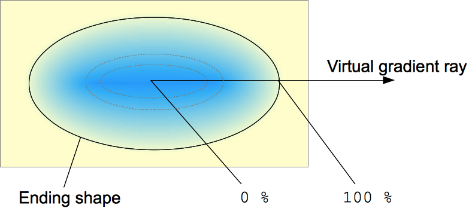

# CSS gradient

> 그레디언트\(gradient\)는 한 색에서 다른 색으로 연결되는 중간 단계를 그라데이션 이라고 하며,  종류에는 선형\(linear\), 원형\(radial\)그레디언트가 있다.

#### 1\) linear-gradient

> 그레디언트\(gradient\)는 한 색에서 다른 색으로 연결되는 중간 단계를 그라데이션이라고 하며, 종류에는 선형\(linear\), 원형\(radial\) 그레디언트가 있다.

### 1. linear grandient

선형 그레디언트\(linear gradient\)는 그레디언트 라인\(gradient line\)이라는 각각의 점이 다른 컬러값을 갖는 하나의 축을 정의할 수 있다. 그레디언트 라인은 그레디언트를 포함하는 box 형태의 영역 중심 좌표와 각도로 정의된다. 그레디언트 컬러값은 시작점\(starting point\), 종료점\(ending point\)과 두 점 사이에 삽입 가능한 색상점\(color stop point\)들로 정의된다.

선형 그레디언트\(linear gradient\)는 그레디언트 라인\(gradient\)이라는 각각의 점이 다른 컬러값을 갖는 하나의 축을 정의할 수 있다. 그레디언트 라인은 그레디언트를 포함하는 box 형태의 영역 중심 좌표와 각도로 정의된다. 그레디언트 컬러값은 시작점\(starting point\), 종료점\(ending point\)과 두 점 사이에 삽입 가능한 색상점\(color stop point\)들로 정의된다.


선형 그레이디언트는 하나의 축\(그레이디언트 라인\)과 두 개 이상의 색상 정지점으로 정의할 수 있다. 축 위의 점은 모두 고유한 색을 가집니다. `linear-gradient()` 함수는 부드러운 그레이디언트를 만들기 위해 축과 직교하는 무수한 선을 그리며, 각 수직선의 색은 축과 교차하는 점의 색과 일치합니다.

* 시작점\(starting point\)
  * 그레디언트 라인상에서 그레디언트 색상이 시작되는 지점 의미.
* 종료점\(ending point\)
  * 시작점과 비슷하게 그레디언트 종료 지점을 의미.


```css
background: linear-gradient([ <angle> | to <side-or-corner> ]? ,<color-stop-list>);
```


```css
/* 기본 선형 그레디언트 각도를 지정하지 않으면 위에서 아래로 적용 */
background: linear-gradient(blue, pink);

/* left에서 시작해서 right에서 종료, blue로 시작해서 red로 종료 */
background: linear-gradient(to right, blue, pink);

/* left bottom 시작해서 right top에서 종료, blue로 시작해서 red로 종료 */
background: linear-gradient(to bottom right, blue, pink);
```

📝`<side-or-corner>`

그레디언트 축의 시작점. `to`이후 최대 두 개 방향을 나타내는 키워드를 사용할 수 있다.  하나는 수평 방향이고, 다른 하나는 수직 방향이다. 기본값`to bottom`이다.

📝`<angle>`

그레디언트 축의 방향으로 `0`deg는 `to top`와 같다. 0 이상의 값을 지정하면 축이 시계 방향으로 돌아간다.

#### 1-1\) gradient angle


선형 그레디언트의 각도는 그레디언트가 어느 방향으로 향하는지 결정하는 데 사용한다. 

```css
/* 0deg(360deg) : 아래에서 위로 그레디언트 방향이 진행 */
background: linear-gradient(0deg, blue, pink);

/* 90deg : 왼쪽에서 오른쪽으로 그레디언트 방향이 진행 */
background: linear-gradient(90deg, blue, pink);

/* 180deg : 위에서 아래로 그레디언트 방향이 진행 */
background: linear-gradient(180deg, blue, pink);
  
/* 270deg : 오른쪽에서 왼쪽으로 그레디언트 방향이 진행 */
background: linear-gradient(270deg, blue, pink);
```

선형 그레디언트는 


💻 gradient\(linear-gradient\) [→\(CODEPEN\)](https://codepen.io/vi2920va/full/qBaeBam)

#### 2\) radial-gradient



원형 그레디언트\(radial gradient\)는 그레디언트 효과를 원형으로 나타낸다.

```css
background: radial-gradient(
    [ <ending-shape> || <size> ]? [ at <position> ]?,
    <color-stop-list>
 );
```

📝`<position>`

중심 위치를 결정.

📝`<ending-shape>`

그레디언트 모양이 원 또는 타원 설정.

📝`<size>`

선형 그레디원트와 달리 원형 그레디언트 모양 크기를 지정할 수 있다. 크기를 나타내기 위해 사용할 수 있는 키워드는 아래와 같다.

| keyword | description |
| :--- | :--- |
| `closest-side` | 원형 그레디언트의 크기가 가장 가까운 면에 닿을 만큼의 크기로 설정. |
| `closest-corner` | 원형 그레디언트의 크기가 가장 가까운 모서리에 닿을 만큼의 크기로 설정. |
| `farthest-side` | 원형 그레디언트의 크기가 가장 먼 면에 닿을 만큼의 크기로 설정. |
| `farthest-corner`\(defalut\) | 원형 그레디언트 크기가 가장 가장 먼 모서리에 닿을 만큼의 크기로 설정.  |

```css
/* 기본 원형 그레디언트 중심에서 바깥쪽으로 타원을 그리면서 배치 */
background: radial-gradient(red, blue);

/* 원형 그레디언트의 각 색상 정지점을 백분율로 배치 */
background: radial-gradient(red 10px, yellow 30%, #1e90ff 50%);

/* 시작점 중심에서 시작해서 둘러싸는 크기가 가장 가까운 면에 닿을 만큼의 크기로 설정 */
background: radial-gradient(ellipse closest-side,
    red, yellow 10%, #1e90ff 50%, beige);

/*  시작점에서 바깥 쪽 상자의 가장 먼 모서리까지의 거리에 따라 크기를 설정 */
background: radial-gradient(ellipse farthest-corner at 90% 90%,
    red, yellow 10%, #1e90ff 50%, beige);

/* 시작점에서 가장 가까운 가장자리 사이의 거리로 높이가 좁기 때문에 하단으로 설정 */
background: radial-gradient(circle closest-side at 25% 75%,
    red, yellow 10%, #1e90ff 50%, beige);
```

💻 gradient\(radial-gradient\) [→\(CODEPEN\)](https://codepen.io/vi2920va/full/VwKovYW)

#### 3\) overlay gradient

오버레이 그레디언트\(overlay gradient\)는 그레디언트 색상과 배경 패턴과 같은 이미지를 사용하는 것을 말한다. 배경 이미지가 보이기 하기 위해선 그레디언트 색상을 투명하게 바꿔주어야 패턴 이미지 보이게 된다.

```css
background: linear-gradient(to right, transparent, mistyrose),
    url("https://mdn.mozillademos.org/files/15525/critters.png");
```

💻 gradient\(overlay-gradient\) [→\(CODEPEN\)](https://codepen.io/vi2920va/full/ExgqarO)

#### 4\) repeating gradient

반복 그레디언트\(repeating gradient\)는 배경 이미지 반복을 사용하는 것과 유사하게 그레디언트를 반복하여 사용할 수 있다.

```css
/* 선형 반복 그레디언트 */
background: repeating-linear-gradient(-45deg, red, red 5px, blue 5px, blue 10px);

/* 원형 반복 그레디언트 */
background: repeating-radial-gradient(circle at 50% 50%,
    red, red 10px, yellow 10px, yellow 20px);

```

💻 gradient\(repating-gradient\) [→\(CODEPEN\)](https://codepen.io/vi2920va/full/BaLXjQy)

#### Reference

Using CSS Gradients [→\(MDN\)](https://developer.mozilla.org/ko/docs/Web/CSS/CSS_Images/Using_CSS_gradients)

linear-gradient [→\(MDN\)](https://developer.mozilla.org/ko/docs/Web/CSS/linear-gradient%28%29)

radial-gradient [→\(MDN\)](https://developer.mozilla.org/en-US/docs/Web/CSS/radial-gradient%28%29)

CSS linear-gradients [→\(SITE\)](https://medium.com/@patrickbrosset/do-you-really-understand-css-linear-gradients-631d9a895caf)

CSS Gradients [→\(SITE\)](https://css-tricks.com/css3-gradients/)


  


