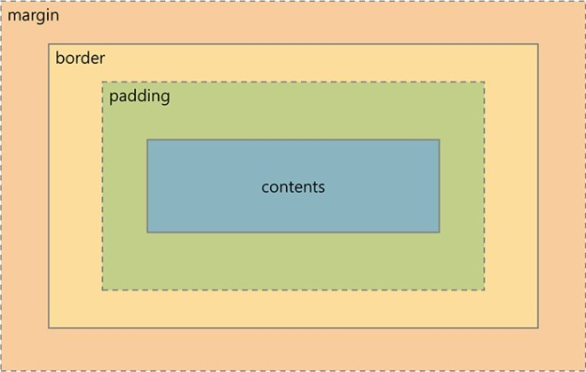
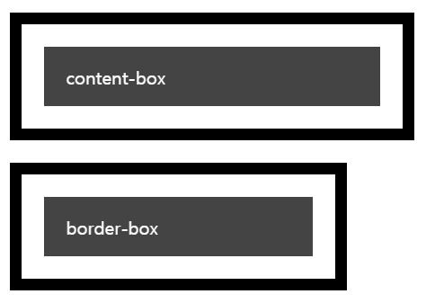

# CSS box-model

### 1. block box

**block box**는 다른 블록 박스에 포함되거나, 포함할 수 있고, `width`, `height` **설정이 가능** 하다.

 내부에 콘텐츠를 포함하지 않을 경우 **높이는 0** 이다.

### 2. inline box

**인라인 박스\(inline box\)**는 다른 인라인 박스에 포함되거나, 포함할 수 있지만, **블록 요소는 포함할 수 없다.**

`width`,`height` **속성 설정이 가능하지 않다. 내부에 포함한 콘텐츠 만큼 높이와 너비를 가지게 된다.**

인라인 박스는 좌, 우 방향으로 `margin`, `padding` 공간을 설정 할 수 있으나 상,하 방향으로는 공간이 설정 되지 않는다.

### 3.  inline block box

  **inline block box**는 기본적으로는 인라인처럼 화면에 렌더링되지만, 블록 박스처럼 `width` , `height` 설정이 가능하다. `, <input>, <button> 등`

### 4. content/padding/border/margin



✋`marigion` 과 `padding`은 속기형 \(단일\) 속성으로 **top → right → bottom → left** 4개를 선택적 또는 일괄 사용할 수 있다.

| property  | description |
| :--- | :--- |
| `content` | 텍스트, 이미지가  들어있는 실질적인 content box |
| `padding` | 내과 테두리 사이의 간격 |
| `border` | 내용, 패딩 주변은 감싸는 테두리 |
| `marigin` | 테두리 외부의 요소 주위에 공간을 만드데 사용  |

### 5. height/width

 `height`및 `width`속성은 요소의 높이와 폭을 설정하는데 사용한다.

| property value | description |
| :--- | :--- |
| `auto`\(defalut\) | 기본값으로 브라우저 width, height에 따라 자동으로 설정한다. |
| `length` | `px` ,`em`, `rem` 등의 단위를 사용하여 직접 지정한다. |
| `%` | 요소가 포함된 영역의 퍼센트 값으로 계산하여 지정한다. |
| `initial` | width, height를 기본값으로 설정한다. |
| `inherit`  | width, height를  부모 값에서 상속 받는다. |

### 6. box-sizing

`box-sizing` 속성은 적용되는 요소에 대해 box model이 처리되는 방법을 제어한다.

즉, 요소의 `width`와 `height`를 계산하는 방법을 정한다.

#### 1\) height/ width 

 일반적으로 요소의 `height` ,`width`계산하기 위한 방법

| property | description |
| :--- | :--- |
| `width` | `width`**+** `padding-left` **+** `padding-right` **+** `border-left` **+** `border-right` |
| `height` | `height`**+** `padding-top` **+** `padding-bottom` **+** `border-top` **+** `border-bottom` |

#### 2\) content-box/ border-box

<table>
  <thead>
    <tr>
      <th style="text-align:left">property value</th>
      <th style="text-align:left">description</th>
    </tr>
  </thead>
  <tbody>
    <tr>
      <td style="text-align:left"><code>content-box</code>(default)</td>
      <td style="text-align:left">
        <p>&#xAE30;&#xBCF8;&#xAC12;&#xC73C;&#xB85C; <code>width</code> ,<code>height</code>&#xC18D;&#xC131;&#xC774;
          &#xCF58;&#xD150;&#xCE20; &#xC601;&#xC5ED;&#xB9CC; &#xD3EC;&#xD568;&#xD55C;&#xB2E4;.</p>
        <p>(&#xC704;&#xC758; &#xACF5;&#xC2DD;&#xC774; &#xC801;&#xC6A9;)</p>
      </td>
    </tr>
    <tr>
      <td style="text-align:left"><code>border-box</code>
      </td>
      <td style="text-align:left"> <code>width</code> &#xC640; <code>height</code> &#xC18D;&#xC131;&#xC774; <code>padding</code>&#xACFC; <code>border</code>&#xB97C;
        &#xD3EC;&#xD568;&#xD55C;&#xB2E4;.</td>
    </tr>
  </tbody>
</table>



```markup
<div class="content-box">
  <p>content-box</p>
</div>

<div class="border-box">
  <p>border-box</p>
</div>
```



```css
.content-box { 
  box-sizing: content-box; 
}
.border-box { 
  box-sizing: border-box; 
}

div{
  width: 300px;
  padding: 20px;
  background: #444;
  color: white;
  border: 10px solid black;
  background-clip: content-box;
  text-indent: 20px;
  margin:20px;
}
```







#### 3\) content-box 에서 `width:100%` 일 경우 문제

`content-box`일 때 `width:100%;`이어서 `padding` 또는 `border`속성을 주게 될 경우 부모의 영역을 초과해서 너비가 넘치는 문제가 생길 수 있다. 

이 문제점을 해결 하기 위해서는 `box-sizing`을 `border-box`로 하거나 `width`를 `auto`로 설정해야 한다.



```markup
<div class="container1">
	<div class="child1">width:100%</div>
	<div class="child2">해결방법1</div>
	<div class="child3">해결방법2</div>
	<div class="child4">해결방법3</div>
</div>
```



```css
/* border-box:100% */
.container1 {
	width: 300px;
	border: 5px solid black;
	background: white;
}

.container1 > div {
	padding: 20px;
	margin-bottom: 20px;
	border: 3px solid #2e88b5;
	background: #ddd;
}

.container1 .child1 {
	width: 100%; /* 문제 */
}

.container1 .child2 {
	width: 100%;
	box-sizing: border-box;
	background: yellow;
}

.container1 .child3 {
	width: auto;
	background: green;
}

.container1 .child4 {
	/* 	width의 기본값: auto */
	background: pink;
}
```







#### Reference

the box model [→\(MDN\)](https://developer.mozilla.org/en-US/docs/Learn/CSS/Building_blocks/The_box_model)

box-sizing [→\(CSS-TRICKS\)](https://css-tricks.com/box-sizing/)

CSS 레이아웃을 배웁시다 [→\(SITE\)](http://ko.learnlayout.com/box-model.html)


