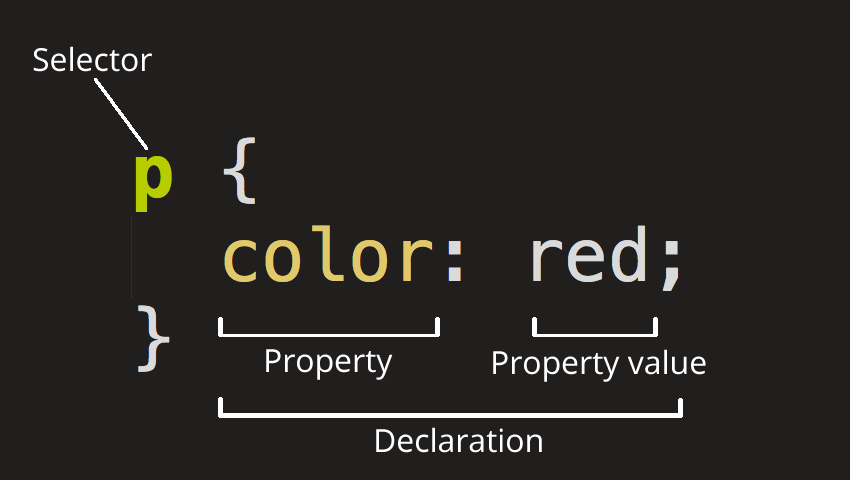

# CSS INTRO

### 1. CSS 정의

CSS\(Cascading Style Sheets\)는 HTML 요소들이 각 종 미디어에서 어떻게 보이는가를 정의하는 데 사용하는 스타일 시트 언어\(style sheet language\)이다. 

#### 1\) CSS 사용하는 목적

> HTML만으로 웹 페이지를 제작할 경우 매우 많은 작업이 소요 되며, 작업을 완성한 후에도 스타일의 변경 및 유지 보수가 힘들다. 그래서 W3C에서는 이러한 문제점을 해결하기 위해서 만든 스타일 시트 언어가 바로 CSS이다.

CSS는 웹 페이지의  스타일을 별도 파일을 저장할 수 있게 해주므로 사이트의 전체 스타일을 손쉽게 제어할 수 있다.

또한 웹 사이트의 스타일을 일관성 있게 유지할 수 있게 해주며, 그에 따른 유지 보수 또한 쉬워진다.

외부 스타일 시트는 보통의 확장자 `.css`파일로 저장한다.

### 2. CSS BASIC SYNTAX



#### 1\) SELECTOR 

선택자\(selector\)는 CSS를 적용하고자 하는 HTML 요소를 가리킨다.

#### 2\) DECLARATION

선언부\(declaratives\)에는 하나 이상의 선언들은 세미콜론\(;\)으로 구분하여 포함할 수 있으며, 중괄호\({}\)를 사용하여 전체를 둘러싼다.

각 선언\(declarartion\)은 CSS 속성명\(property name\)과 속성값\(property value\)을 가지며, 그 둘은 콜론\(:\)으로 연결된다. 이러한 CSS 선언은 언제나 마지막에 세미콜론\(;\)으로 끝낸다.

#### 3\) PROPERTY NAME

선택한 HTML요소를 꾸밀 수 있는 방법.

#### 4\) PROPERTY VALUE

속성\(property\)과 오른쪽 콜론\(:\)뒤에 사용할 수 있는 값을 크기 단위 또는 색상 표현 단위 등 특정 단위로 지정한다.

### 3. CSS STYLING

#### 1\) INLINE STYLE

 인라인 스타일\(inline style\)은 HTML요소에 style 속성을 사용하여 CSS를 적용하는 방법.

```markup

<body>
    <h2 style="color:green;">interal style sheet</h2>
</body>

```

#### 2\) INTERNAL STYLE SHEET

내부 스타일 시트\(internal style sheet\)는 HTML 문서 내의 `<head>`요소 내에 `<style>` 요소를 사용하여 CSS 스타일을 적용하는 방법이다.

```markup
<head>
  <style>
    section {
      color: #903000;
    }
  
    h1 {
      color: tan;
    }
  
    abbr {
      cursor: help;
    }
  </style>
</head>
```

#### 3\) EXTERNAL STYLE SHEET

외부 스타일 시트\(external style sheet\)는 스타일을 적용할 웹 페이지의 `<head>` 요소에`<link>` 요소를 사용하여 외부 스타일 시트를 포함해야만 스타일이 적용된다. 

```markup
<head>
    <link rel="stylesheet" href="css/style.css">
</head>
```

#### 4\) 스타일 적용 우선 순위

위에서 설명한 스타일 적용 방법들이 혼합되어 사용될 경우 최종적으로는 스타일은 아래와 같은 순서에 따라 결정된다.

1. 인라인 스타일 
2. 내부 또는 외부 스타일 시트
3. 웹 브라우저의 기본 스타일

🔎 인라인 스타일이 적용된 요소에는 외부 스타일 시트와 상관없이 무조건 인라인 스타일이 적용된다.

```markup
<link rel="stylesheet" type="text/css" href="../css/style.css">
...
<h1>External Style Sheet</h2>
<h1 style="color:red;">Inline style</h2>
```

