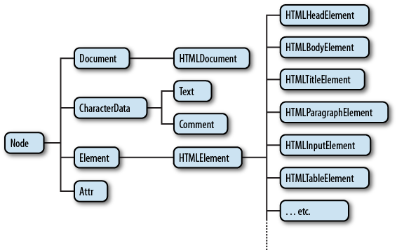

# BOM, DOM 개요

### 1. Browser Object Model

웹 서비스 개발은 브라우저와 밀접한 관련이 있다. 모든 서비스는 사실 브라우저 바탕으로 실행되기 때문이다. 이때 브라우저와 관련된 객체들의 집합을 브라우저 객체 모델\(BOM, Browser Object Model\)이라고 한다. 참고로 DOM은 BOM 중 하나이다.  

### 2. Document Object Model

브라우저의 렌더링 엔진은 웹 문서를 로드한 후, 파싱하여 웹 문서를 브라우저가 이해할 수 있는 구조로 구성하여 메모리를 적재하는데 이를 문서 객체 모델\(DOM, Document Object Model\)이라고 한다.

### 3. DOM의 종류

W3C DOM 표준은 세 가지 모델로 구분된다.

* Core DOM : 모든 문서 타입을 위한 DOM 모델.
* HTML DOM : HTML  문서 타입을 위한 DOM 모델.
* XML DOM : XML 문서 타입을 위한 DOM 모델.

### 4. DOM tree

DOM은 웹 문서의 요소를 부모 요소와 자식 요소로 구분하여 계층적 구조로 인식한다. DOM의 트리 구조는 노드와 가지로 표현한다. 노드는 웹 문서의 HTML 태그 요소만 표현 하는 것이 아니다. 모든 텍스트와 이미지, 태그의 속성들 까지 객체화 하여 DOM tree에 표현한다.

#### 1\) 문서 노드\(Document Node\)

트리의 최상위에 존재하며, 하위 자식 노드에 접근하기 위해서는 문서 노드\(Document Node\)를 통해야 한다. DOM tree의 접근하기 하기 시작점 이다.

#### 2\) 요소 노드\(Element Node\)

웹 문서의 태그는 요소 노드\(Element Node\)로 표현된다. 모든 요소 노드는 속성 노드\(Atrribute Node\)와 텍스트 노드\(Text Node\)를 자식으로 가질 수 있는데, 자식 노드를 변경하여 웹 페이지를 동적으로 조작할 수 있다.

#### 3\) 속성 노드\(Atrribute Node\)

태그의 모든 속성은 속성 노드\(Atrribute Node\)로 표현하며 해당 태그의 자식 노드로 인식된다.

#### 4\) 텍스트 노드\(Text Node\)

HTML 요소의 텍스트를 표현한다. 텍스트 노드\(Text Node\)는 요소 노드의 자식이며 자신의 자식 노드를 가질 수 없다. 즉, 텍스트 노드는 DOM tree의 최종단이다.

#### 5\) 주석 노드\(Comment Node\)

주석은 주석 노드\(Comment Node\)로 표현한다.

### 5. DOM과 JavaScript 

문서\(Document\)와 문서의 요소\(element\)에 접근하기 위해서는 DOM이 사용 된다. DOM은 프로그래밍 언어는 아니지만, DOM이 없다면 JavaScript 언어는 웹 페이지 또는 XML 페이지 및 요소들과 관련된 모델이나 개념들에 대한 정보를 가지게 못하게 된다. JavaScript는 DOM에 필요한 수단\(API\)를 제공한다.

