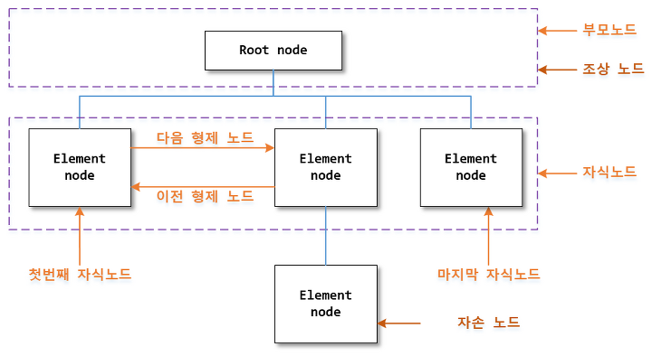

# Node Object

## 노드 객체\(Node Object\)

HTML문서의 정보는 노드 트리\(Node tree\)라고 불리는 계층적 구조에 저장된다. 노드 트리는 노드들의 집합이며, 노드 관계를 보여준다. 노드 트리는 최상위 레벨인 루트 노드\(root node\)로 부터 시작하여, 가장 낮은 레벨인 텍스트 노드 까지 뻗어 내려간다. JavaScript에서는 HTML DOM을 이용하여 노드 트리에 포함된 모든 노드에 접근 할 수 있다.

### 1. 노드의 종류

W3C HTML DOM 표준에 따르면,  HTML 문서의 모든 것은 노드 이다.  HTML 문서를 구성하는 대표적인 노드의 종류는 다음과 같다.

| node | description |
| :--- | :--- |
| 문서 노드\(document node\) | HTML 문서 전체를 나타내는 노드. |
| 요소 노드\(element node\) | 모든 HTML 요소는 요소 노드이며, 속성 노드를 가질 수 있는 유일한 노드. |
| 속성 노드\(attribute node\) | 모든 HTML 요소의 속성은 속성 노드이며, 요소 노드에 관한 정보를 가지고 있다. 하지만 해당 요소 노드의 자식 노드\(child node\)에는 포함되지 않는다. |
| 텍스트 노드\(text node\) | HTML 문서의 모든 텍스트 텍스트 노드. |
| 주석 노드\(comment node\) | HTML 문서의 모든 주석은 주석 노드. |

### 2. 노드 간의 관계

노드 트리의 모든 노드는 서로 계층적 관계를 맺고 있다. 

| node | description |
| :--- | :--- |
| 루트 노드\(root node\) | 노드 트리의 가장 상위에 존재하는 단 하나의 루트 노드를 가진다. |
| 부모 노드\(parent node\) | 루트 노드를 제외한 모든 노드는 단 하나의 부모 노드를 가진다. |
| 자식 노드\(child node\) | 모든 요소 노드는 자식 노드를 가질 수 있다. |
| 형제 노드\(sibling node\) | 같은 부모 노드를 가지는 모든 노드를 가리킨다. |
| 조상 노드\(ancestor node\) | 부모 노드를 포함해 계층적으로 현재 노드 보다 상위에 존재하는 모든 노드를 가리킨다. |
| 자손 노드\(descendant node\) | 자식 노드를 포함해 계층적으로 현재 노드 보다 하위에 존재하는 모든 노드를 가리킨다. |

