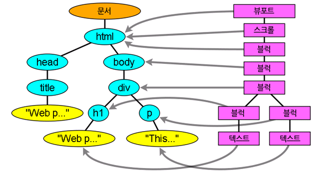
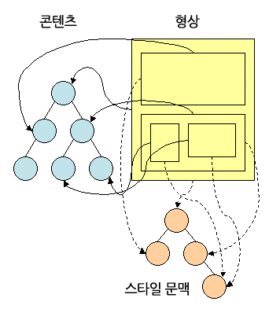
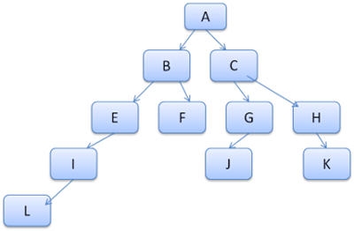
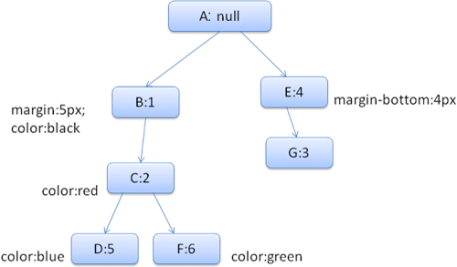
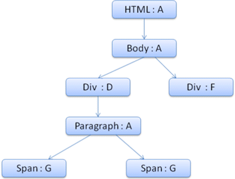

# 브라우저와 동작 원리 \(2\)

### CSS 파싱

> 문맥 자유 문법\(context free grmmar\)는 쉽게 설명하면 하나의 비말단 노드만을 고려하여 문자열 생성하기 때문에 문맥에서 자유롭다는 의미에서 문맥 자유 문법이라고 불린다.


```text
omment   \/*[^]*+([^/][^]*+)\/
num        [0-9]+|[0-9]"."[0-9]+
nonascii    [\200-\377]
nmstart    [_a-z]|{nonascii}|{escape}
nmchar    [_a-z0-9-]|{nonascii}|{escape}
name        {nmchar}+
ident        {nmstart}{nmchar}
```


"ident"클래스 이름 처럼 식별자\(idenfiner\)를 줄인 것인다. "name"은 요소의 아이디\("\#"으로 참조하는\)이다.

구문 문법은 BNF로 설명되어 있다.

```javascript
Ruleset  
   : selector [ ',' S* selector ]*
       '{' S* declaration [ ';' S* declaration ]* '}' S*
   ;
Selector  
   : simple_selector [ combinator selector | S+ [ combinator? selector ]? ]?
   ;
simple_selector  
   : element_name [ HASH | class | attrib | pseudo ]*
   | [ HASH | class | attrib | pseudo ]+
   ;
Class  
   : '.' IDENT
   ;
element_name  
   : IDENT | '*'
   ;
Attrib  
   : '[' S* IDENT S* [ [ '=' | INCLUDES | DASHMATCH ] S*
       [ IDENT | STRING ] S* ] ']'
   ;
Pseudo  
   : ':' [ IDENT | FUNCTION S* [IDENT S*] ')' ]
   ;
```


```css
div.error, a.error {  
   color: red;
   font-weight: bold;
}
```


`div.error`와 `a.error`는 선택자\(selector\)이다. 중괄화 안쪽에는 이 룰셋에 적용된 규칙이 포함되어 있다. 이 구조는 공식적으로 다음과 같이 정의되어 있다.

```css
Ruleset  
   : selector [ ',' S* selector ]*
       '{' S* declaration [ ';' S* declaration ]* '}' S*
   ;
```

룰셋은 쉼표와 공백\(S가 공백을 의미\)으로 구분된 하나 또는 여러 개 선택자라는 것을 의미한다. 룰셋은 중괄호 내부에 하나 또는 세미콜론으로 구분된 여러개의 선언은 포함한다. "선언"과"선택자"는 이어지는 BNF에 정의되어 있다.

#### 1\) 웹킷 CSS 파서

웹킷은 CSS문법 파일로부터 자동으로 파서를 생성하기 위해 플렉스와 바이슨 파서 생성기를 사용한다. 파서소개에서 언급했던 것처럼 상향식 이동 감소 파서를 생성한다. 파이어폭스는 직접 작성한 하향식 파서를 사용한다. 두 경우 모두 각 CSS파일은 스타일 시트 객체로 파싱되고 각 객체는 CSS규칙을 포함한다. CSS규칙 객체는 선택자와 선언 객체 그리고 CSS문법과 일치 하는 다른 객체를 포함한다.


### 스크립트와 스타일 시트의 진행순서

#### 1\) 스크립트

 웹은 파싱과 실행이 동시에 수행되는 **동기화\(synchronous\) 모델**이다. 제작자는 파서가 &lt;script&gt; 태그를 만나면 즉시 파싱하고 실행하기를 기대한다. 스크립트가 실행되는 동안 문서의 파싱은 중단된다. 스크립트가 외부에 있는 경우 우선 네트워크로부터 자원을 가져와야 하는데 이 또한 실시간으로 처리되고 자원을 받을 때까지 파싱은 중단된다. 이 모델은 수 년간 지속됐다. 작성자는 스크립트를 "**defer\(지연\)**"으로 표시할 수 있는데 **defer**로 표시하게 되면 **문서 파싱은 중단되지 않고 문서 파싱이 완료된 이후에 스크립트가 실행된다.** **HTML5는 스크립트를 비동기\(asynchronous\)로 처리하는 속성을 추가했기 때문에 별도의 맥락에 의해 파싱되고 실행된다.**

#### 2\) 예측 파싱

웹킷과 파이어폭스는 예측 파싱과 같은 최적화를 지원한다. 스크립트를 실행하는 동안 다른 스레드는 네트워크로부터 다른 자원을 찾아 내려받고 문서의 나머지 부분을 파싱한다. 이런 방법은 자원을 병렬로 연결하여 받을 수 있고 전체적인 속도를 개선한다. 참고로 예측파서는 DOM 트리를 수정하지 않고 메인 파서의 일로 넘긴다. 예측 파서는 **외부 스크립트, 외부 스타일 시트와 외부 이미지와 같이 참조된 외부 자원을 파싱**할 뿐이다.

#### 3\) 스타일 시트

스타일 시트는 다른 모델을 사용한다. 이론적으로 스타일 시트는 DOM 트리를 변경하지 않기 때문에 문서 파싱을 기다리거나 중단할 이유가 없다. 그러나 스크립트가 문서를 파싱하는 동안 스타일 정보를 요청하는 경우라면 문제가 된다. 스타일이 파싱되지 않은 상태라면 스크립트는 잘못된 결과를 내놓기 때문에 많은 문제를 야기한다. 이런 문제는 흔치 않은 것처럼 보이지만 매우 빈번하게 발생한다. 파이어폭스는 아직 로드 중이거나 파싱 중인 스타일 시트가 있는 경우 모든 스크립트의 실행을 중단한다. 한편 웹킷은 로드되지 않은 스타일 시트 가운데 문제가 될만한 속성이 있을 때만 스크립트를 중단한다.

### 렌더 트리 구축

DOM 트리가 구축되는 동안 브라우저는 렌더 트리를 구축한다. 표시해야 할 순서와 문서의 시각적인 구성 요소로서 올바른 순서로 내용을 그려낼 수 있도록 하기 위함이다.

파이어폭스는 이 구성 요소를 "frames"라고 부르고 웹킷은 "renderer" 또는 "render object"라는 용어를 사용한다.

렌더러는 자신과 자식 요소를 어떻게 배치하고 그려내야 하는지 알고 있다.


```javascript
class RenderObject { virtual  
    void layout(); virtual
    void paint(PaintInfo); virtual
    void rect repaintRect();
    Node * node; //the DOM node
    RenderStyle * style; // the computed style
    RenderLayer * containgLayer; //the containing z-index layer
}
```


각 렌더러는 CSS2 명세에 따라 노드의 CSS 박스에 부합하는 사각형을 표시한다. 렌더러는 너비, 높이 그리고 위치와 같은 기하학적 정보를 포함한다.

박스 유형은 노드와 관련된 "display" 스타일 속성의 영향을 받는다\(스타일 계산 참고\).


```javascript
RenderObject* RenderObject::createObject(Node* node, RenderStyle* style)  
{
    Document* doc = node->document();
    RenderArena* arena = doc->renderArena();
    …
    RenderObject* o = 0;
 
    switch (style->display()) {
        case NONE:
            break;
        case INLINE:
            o = new (arena) RenderInline(node);
            break;
        case BLOCK:
            o = new (arena) RenderBlock(node);
            break;
        case INLINE_BLOCK:
            o = new (arena) RenderBlock(node);
            break;
        case LIST_ITEM:
            o = new (arena) RenderListItem(node);
            break;
        ...
    }
    return o;
}
```


요소의 유형 또한 고려해야 하는데 폼 컨트롤과 표는 특별한 구조이다. 요소가 특별한 렌더러를 만들어야 한다면 웹킷은 createRenderer 메서드를 무시하고 비기하학 정보를 포함하는 스타일 객체를 표시한다.

### DOM 트리와 렌더 트리의 관계

렌더러는 DOM 요소에 부합하지만 1:1로 대응하는 관계는 아니다. 예를 들어 "head" 요소와 같은 비시각적 DOM 요소는 렌더 트리에 추가되지 않는다. 또한 display 속성에 "none"값이 할당된 요소는 트리에 나타나지 않는다. \(visibility 속성에 "hidden" 값이 할당된 요소는 트리에 나타난다\)

여러 개의 시각 객체와 대응하는 DOM 요소도 있는데 이것들은 보통 하나의 사각형으로 묘사할 수 없는 복잡한 구조이다. 예를 들면 "select" 요소는 '표시 영역, 드롭다운 목록, 버튼' 표시를 위한 3개의 렌더러가 있다. 또한 한 줄에 충분히 표시할 수 없는 문자가 여러 줄로 바뀔 때 새로운 줄은 별도의 렌더러로 추가된다. 여러 렌더러와 대응하는 또 다른 예는 깨진 HTML이다. CSS 명세에 의하면 인라인 박스는 블록 박스만 포함하거나 인라인 박스만을 포함해야 하는데 인라인 블록 박스가 섞인 경우 인라인 박스를 감싸기 위한 익명의 블록 렌더러가 생성된다.

어떤 렌더 객체는 DOM 노드에 대응하지만 트리의 동일한 위치에 있지 않다. float 처리 요소 또는 position 속성 값이 absolute로 처리된 요소는 흐름에서 벗어나 트리의 다른 곳에 배치된 상태로 형상이 그려진다. 대신 자리 표시자가 원래 있어야 할 곳에 배치된다.



### 트리를 구축하는 과정

파이어폭스에서 프레젠테이션은 DOM 업데이트를 위한 리스너로 등록된다. 프레젠테이션은 형상 만들기를 FrameConstructor 에 위임하고 FrameConstructor 는 스타일\(스타일 계산 참고\)을 결정하고 형상을 만든다.

웹킷에서는 스타일을 결정하고 렌더러를 만드는 과정을 "**attachment**"라고 부른다. 모든 DOM 노드에는 "**attach**" 메서드가 있다. **attachment**는 동기적인데 DOM 트리에 노드를 추가하면 새 노드의 "**attach**" 메서드를 호출한다.

html 태그와 body 태그를 처리함으로써 렌더 트리 루트를 구성한다. 루트 렌더 객체는 CSS 명세에서 **포함 블록** \(다른 모든 블록을 포함하는 최상위 블록\)이라고 부르는 것과 일치한다. 파이어폭스는 이것을 ViewPortFrame 이라 부르고 웹킷은 RenderView 라고 부른다. 이것이 문서가 가리키는 **렌더 객체**이다. 트리의 나머지 부분은 DOM 노드를 추가함으로써 구축된다.

### 스타일 계산

렌더 트리를 구축하려면 각 렌더 객체의 시각적 속성에 대한 계산이 필요한데 이것은 각 요소의 스타일 속성을 계산함으로써 처리된다.

스타일은 인라인 스타일 요소와 HTML의 시각적 속성\(예를 들면 bgcolor 같은 HTML 속성\)과 같은 다양한 형태의 스타일 시트를 포함하는데 HTML의 시각적 속성들은 대응하는 CSS 스타일 속성으로 변환된다.

최초의 스타일 시트는 브라우저가 제공하는 기본 스타일 시트인데 페이지 제작자 또는 사용자도 이를 제공할 수 있다. 브라우저는 사용자가 선호하는 스타일을 정의할 수 있도록 지원하는데 파이어폭스의 경우 "파이어폭스 프로필" 폴더에 있는 스타일 시트를 변경함으로써 사용자 선호 스타일을 정의할 수 있다.

스타일을 계산하는 일에는 다음과 같은 몇 가지 어려움이 따른다.

1. 스타일 데이터는 구성이 매우 광범위하다. 수 많은 스타일 속성들을 수용하면서 메모리 문제를 야기할 수 있다.
2. 최적화되어 있지 않다면 각 요소에 할당된 규칙을 찾는 것은 성능 문제를 야기할 수 있다. 

   `div div div div { ... }`

3. 규칙을 적용하는 것은 계층 구조를 파악해야 하는 꽤나 복잡한 다단계 규칙을 수반한다.

브라우저가 이 문제를 어떻게 처리하는지 살펴보자.

#### 1\) 스타일 정보  공유

웹킷 노드는 스타일 객체\(renderstyle\)을 참조하는데 이 객체는 일정 조건 아래 공유할 수 있다. 노드가 형제이거나 또는 사촌일 때 공유하며 다음과 같은 조건일 때 공유할 수 있다.

1. 동일한 마우스 반응 상태를 가진 요소여야 한다. 

   `:hover, :focus` 등.

2. 아이디가 없는 요소여야 한다.
3. 태그 이름이 일치해야 한다.
4. 클래스 속성이 일치해야 한다.
5. 지정된 속성이 일치해야 한다.
6. 링크 상태가 일치해야 한다.
7. focus 상태가 일치해야 한다.
8. 문서 전체에서 속성 선택자의 영향을 받는 요소가 없어야 한다. 여기서 영향이라 함은 속성 선택자를 사용한 경우를 말한다. 

   `input[type=text]{...}`

9. 요소에 인라인 스타일 속성이 없어야 한다. 

   `<p style="..."></p>`

10. 문서 전체에서 형제 선택자를 사용하지 않아야 한다. 웹 코어는 형제 선택자를 만나면 전역 스위치를 열고 전체 문서의 스타일 공유를 중단한다. 형제 선택자는 `+`선택자와 `:first-child, :last-child`를 포함한다.

#### 2\) 파이어폭스 규칙 트리

파이어폭스는 스타일 계산을 쉽게 처리하기 위해 규칙트리와 스타일 문맥 트리라고 하는 두 개의 트리를 더 가지고 있다. 웹킷도 스타일 객체를 가지고 있지만 스타일 문맥 트리처럼 저장되지 않고 오직 DOM 노드로 관련 스타일을 처리한다.



스타일 문맥에는 최종 값이 저장되어 있다. 값은 올바른 순서 안에서 부합하는 규칙을 적용하고 논리로부터 구체적인 값으로 변환함으로써 계산된다. 예를 들어 논리적인 값이 화면의 백분율\(%\)이라면 이 값은 계산에 의해 절대적인 단위\(px\)로 변환된다. 이런 규칙 트리 아이디어는 정말 현명하다. 노드 사이에서 이 값을 공유함으로써 다시 계산하는 일을 방지하기 때문이다.

부합하는 모든 규칙은 트리에 저장하는데 경로의 하위 노드가 높은 우선순위를 갖는다. 규칙 저장은 느리게 처리된다. 트리는 처음부터 모든 노드를 계산하지 않지만 노드 스타일이 계산될 필요가 있을 때 계산된 경로를 트리에 추가한다.

트리 경로를 어휘 목록 속에 있는 단어라고 생각하고 이미 규칙 트리를 계산했다고 가정해 보자.



내용 트리에서 또 다른 요소에 부합하는 규칙이 필요하다고 가정하고 부합하는 규칙이 순서에 따라 B-E-I라고 치자. 브라우저는 이미 A-B-E-I-L 경로를 계산했기 때문에 트리 안에 이 경로가 있고 할 일이 줄었다.

트리가 작업량을 줄이는 방법을 살펴보자.

#### ① 구조체로 분리

스타일 문맥은 구조체\(structs\)로 나뉘는데 선 또는 색상과 같은 종류의 스타일 정보를 포함한다. 구조체의 속성들은 상속되거나 또는 상속되지 않는다. 속성들은 요소에 따라 정해져 있지 않은 한 부모로부터 상속된다. 상속되지 않는 속성들은 "재설정\(reset\)" 속성이라 부르는데 상속을 받지 않는 것으로 정해져 있다면 기본 값을 사용한다.

트리는 최종으로 계산된 값을 포함하여 전체 구조체를 저장하는 방법으로 도움을 준다. 하위 노드에 구조체를 위한 속성 선언이 없다면 저장된 상위 노드의 구조체 속성을 그대로 받아서 사용하는 것이다.

#### ② 규칙 트리를 사용하여 스타일 문맥을 계산

어떤 요소의 스타일 문맥을 계산할 때 가장 먼저 규칙 트리의 경로를 계산하거나 또는 이미 존재하는 경로를 사용한다. 그 다음 새로운 스타일 문맥으로 채우기 위해 경로 안에서 규칙을 적용한다. 가장 높은 우선순위\(보통 가장 구체적인 선택자\)를 가진 경로의 하위 노드에서 시작하여 구조체가 가득 찰 때까지 트리의 상단으로 거슬러 올라간다. 규칙 노드 안에서 구조체를 위한 특별한 선언이 없다면 상당한 최적화를 할 수 있다. 선언이 가득 채워질 때까지 노드 트리의 상위로 찾아 올라가서 간단하게 적용하면 최상의 최적화가 되고 모든 구조체는 공유된다. 이것은 최종 값과 메모리 계산을 절약한다.

선언이 완전하지 않으면 구조체가 채워질 때까지 트리의 상단으로 거슬러 올라간다.

구조체에서 어떤 선언도 발견할 수 없는 경우 구조체는 "**상속\(inherit\)**" 타입인데 문맥 트리에서 부모 구조체를 향하면서 구조체를 공유한다. 재설정 구조체라면 기본 값들이 사용될 것이다.

가장 구체적인 노드에 값을 추가하면 실제 값으로 변환하기 위해 약간의 추가적인 계산을 할 필요가 있는데 트리 노드에서 결과를 저장하기 때문에 자식에게도 사용할 수 있다.

같은 트리 노드를 가리키는 형제 요소가 있는 경우 전체 스타일 문맥이 이들 사이에서 공유된다.



```markup
<div class="err" id="div1">  
    <p>
    this is a <span class="big"> big error </span>
    this is also a <span class="big"> very big error</span> error
    </p>
</div>  
<div class="err" id="div2">another error</div>  
```



```css
.err {
  color: red
}

.big {
  margin-top: 3px
}

div span {
  margin-bottom: 4px
}

#div1 {
  color: blue
}

#div2 {
  color: green
}
```



색상과 여백 이렇게 두개의 구조체를 채울 필요가 있다고 치자. 색상 구조체는 오직 색상 값만 포함하고 여백 구조체는 네 개의 면에 대한 값을 포함한다.

결과적으로 규칙트리는 아래처럼 보일 것이다. 노드는 노드 이름과 노드가 가리키는 규칙의 번호로 표시되어 있다.



문맥 트리는 아래처럼 보일 것이다. 노드는 노드 이름과 노드가 가리키는 규칙 노드로 표시되어 있다.



HTML을 파싱하여 두 번째 `<div>` 태그인 `<div class="err" id="div2">` 에 이르렀다고 가정하자. 이 노드에 필요한 스타일 문맥을 생성하고 스타일 구조체를 채워야 한다.

두 번째 `<div>` 규칙에 맞는 것을 찾으면 1, 2, 6이 되는데 이것은 요소가 사용할 수 있는 트리 경로 \(규칙 트리의 B:1, C:2\)가 이미 존재한다는 것을 의미하고 규칙 6\(규칙 트리에서 노드 F:6\)에 이르는 또 다른 노드를 문맥 트리에 추가하면 된다. 스타일 문맥을 생성하고 문맥 트리에 추가하면 새로운 스타일 문맥이 규칙 트리의 F:6 노드를 가리킨다.

이제는 스타일 구조체를 채워야 하는데 margin 구조체를 채우는 것으로부터 시작한다. 마지막 규칙 노드\(F:6\)가 margin 구조체에 포함하지 않기 때문에 이전 노드에 저장된 구조체를 찾을 때까지 위로 거슬러 올라가서 계산된 값을 사용한다. margin 규칙이 선언된 최상위 노드의 구조체를 규칙 노드 B:1에서 찾았다.

color 구조체 정의에는 저장된 구조체를 사용할 수 없다. color는 이미 하나의 속성 값을 가지고 있기 때문에 다른 값을 채우기 위해 규칙 트리 상단으로 거슬러 올라갈 필요가 없다. 최종 값을 계산하고 계산된 값\(문자열에서 RGB 등으로 변환된\)을 이 노드에 저장할 것이다.

두 번째 `<span>` 요소에 대한 작업은 훨씬 쉽다. 맞는 규칙을 찾다보면 이전 span과 같이 규칙 트리의 G:3을 가리킨다는 결론에 이르는데 동일한 노드를 가리키는 형제가 있기 때문에 전체 스타일 문맥을 공유하고 이전 span의 문맥을 취하면 된다.

부모로부터 상속된 규칙을 포함하는 구조체의 경우 캐싱은 문맥 트리에서 수행된다. \(color 속성은 실제로 상속된다. 그러나 파이어폭스는 재설정으로 처리해서 규칙 트리에 저장한다.\)


```css
p {
  font-family: Verdana;
  font-size: 10px;
  font-weight: bold;
}
```


문맥 트리에서 `<div>`의 자식인 `<p>` 요소는 그 부모의 동일 글꼴 구조체를 공유할 수 있다. `<p>`요소에 지정된 규칙이 없는 경우라도 마찬가지다.

규칙 트리가 없는 웹킷은 선언이 일치하는 규칙이 4번 탐색된다. 우선 중요하지 않은 상위 속성\(display와 같은 속성이 의존하기 때문\)이 적용되고, 그 다음 중요한 상위 속성이 적용된다. 그리고 나서 중요하지 않은 일반 속성이 적용되고 마지막으로 중요한 일반 속성이 적용된다. 이것은 여러 번 나타나는 속성들이 정확한 다단계 순서에 따라 결정된다는 것을 의미하고 가장 마지막 값이 적용된다.

요약하면 스타일 객체는 전체 또는 일부를 공유함으로써 1번과 3번 문제를 해결한다. 파이어폭스 규칙 트리는 올바른 순서에 따라 속성을 적용하는 것을 돕는다.

#### 3\) 쉬운 선택을 위한 규칙 다루기

스타일 규칙을 위한 몇 가지 소스가 있다

```markup
<!-- CSS 규칙을 외부 스타일 시트에서 선언하거나 style 요소에서 선언 -->
<style>
  p{
   color: blue;
 }
</style>

<!-- 인라인 스타일 속성 -->
<p style="color:blue">text</p> 

<!-- HTML의 시각적 속성은 CSS 규칙으로 변환된다. -->
<p bgcolor="blue">text</p>  
```

마지막 두 가지 스타일은 자신이 스타일 속성을 가지고 있거나 HTML 속성을 이용하여 연결할 수 있기 때문에 요소에 쉽게 연결된다.

위에서 언급한 문제 2번에 따라 CSS 규칙을 연결하는 것은 까다로울 수 있는데 이 문제를 해결하려면 쉽게 접근할 수 있도록 규칙을 교묘하게 처리해야 한다.

스타일 시트를 파싱한 후 규칙은 선택자에 따라 여러 해시맵 중 하나에 추가된다. 아이디, 클래스 이름, 태그 이름을 사용한 맵이 있고 이런 분류에 맞지 않는 것을 위한 일반적인 맵이 있다. 선택자가 아이디인 경우 규칙은 아이디 맵에 추가되고 선택자가 클래스인 경우 규칙은 클래스 맵에 추가된다.

이런 처리 작업을 통해 규칙을 찾는 일은 훨씬 쉬워진다. 맵에서 특정 요소와 관련 있는 규칙을 추출할 수 있기 때문에 모든 선언을 찾아 볼 필요가 없다. 이러한 최적화는 찾아야 할 규칙의 95% 이상을 제거하기 때문에 규칙을 찾는 동안 모든 선언을 고려할 필요가 없다.

다음 스타일 규칙 예제를 살펴보자.



```markup
<p class="error">an error occurred </p>  
<div id=" messageDiv">this is a message</div> 
```



```css
p.error {
  color: red
}

#messageDiv {
  height: 50px
}

div {
  margin: 5px
}
```



우선 p 요소의 규칙을 찾아보자. 클래스 맵은 발견된 "p.error"를 위한 규칙 하부의 "error" 키를 찾았다. div 요소는 아이디 맵\(키는 아이디\)과 태그 맵에 관련 규칙이 있다. 그러므로 이제 남은 작업은 키를 사용하여 추출한 규칙 중에 실제로 일치하는 규칙을 찾는 것이다.

```css
table div {
  margin: 5px
}
```

이 예제는 여전히 태그 맵에서 규칙을 추출할 것이다. 가장 우측에 있는 선택자가 키이기 때문이다. 그러나 앞서 작성한 div 요소와는 일치하지 않는다. 상위에 table이 없기 때문이다.

웹킷과 파이어폭스 모두 이런 방식으로 처리하고 있다.

#### 4\) 다단계 순세에 따라 규칙 적용하기

스타일 객체는 모든 CSS 속성을 포함하고 있는데 어떤 규칙과도 일치하지 않는 일부 속성은 부모 요소의 스타일 객체로부터 상속 받는다. 그 외 다른 속성들은 기본 값으로 설정된다.

문제는 하나 이상의 속성이 정의될 때 시작되고 다단계 순서가 이 문제를 해결하게 된다.

####  **① 스타일 시트 다단계 순서**

스타일 속성 선언은 여러 스타일 시트에서 나타날 수 있고 하나의 스타일 시트 안에서도 여러 번 나타날 수 있는데 이것은 규칙을 적용하는 순서가 매우 중요하다는 것을 의미한다. 이것을 "다단계\(cascade\)" 순서라고 한다. CSS2 명세에 따르면 다단계 순서는 다음과 같다\(우선 순위가 낮은 것에서 높은 순서임\).

1. 브라우저 선언 \(browser declarations\)
2. 사용자 일반 선언 \(user normal declarations\)
3. 저작자 일반 선언 \(author normal declarations\)
4. 저작자 중요 선언 \(author important declarations\)
5. 사용자 중요 선언 \(user important declarations\)

브라우저 선언의 중요도가 가장 낮으며 사용자가 저작자의 선언을 덮어 쓸 수 있는 것은 선언이 중요하다고 표시한 경우뿐이다. 같은 순서 안에서 동일한 속성 선언은 특정성\(specificity\)에 의해 정렬이 되고 이 순서는 곧 특정성이 된다. HTML 시각 속성은 CSS 속성 선언으로 변환되고 변환된 속성들은 저작자 일반 선언 규칙으로 간주된다.

#### **② 특전성**

선택자 특정성은 [CSS](http://www.w3.org/TR/CSS2/cascade.html)[2 ](http://www.w3.org/TR/CSS2/cascade.html)[명세](http://www.w3.org/TR/CSS2/cascade.html)에 다음과 같이 정의되어 있다.

* 선택자 없이 'style' 속성이 선언된 것이면 1을 센다. 그렇지 않으면 0을 센다. \(=a\)
* 선택자에 포함된 아이디 선택자 개수를 센다. \(=b\)
* 선택자에 포함된 속성 선택자\(클래스 선택자와 속성 선택자\)와 가상 클래스 선택자의 숫자를 센다. \(=c\)
* 선택자에 포함된 요소 선택자와 가상 요소 선택자의 숫자를 센다. \(=d\)

네 개의 연결된 숫자 a-b-c-d \(큰 진법의 숫자\)를 연결하면 특정성의 값이 된다.

사용할 진법은 분류 중에 가장 높은 숫자에 의해서 정의된다. 예를 들어 a=14이면 16진수를 사용할 수 있다. 흔치는 않겠지만 a=17과 같은 경우라면 17진법이 필요할 것이다. 17진법을 사용해야 하는 경우는 html body div div p … \(선택자에 17개의 태그를 사용하는 경우로 흔치 않음\)와 같이 선택자를 사용하는 경우에 발생할 수 있다.

다음과 같은 몇 가지 예제를 참고하기 바란다.

```css
*{} /* a=0 b=0 c=0 d=0 -> specificity = 0,0,0,0 */
li{} /* a=0 b=0 c=0 d=1 -> specificity = 0,0,0,1 */  
li:first-line{} /* a=0 b=0 c=0 d=2 -> specificity = 0,0,0,2 */  
ul li{} /* a=0 b=0 c=0 d=2 -> specificity = 0,0,0,2 */  
ul ol+li{} /* a=0 b=0 c=0 d=3 -> specificity = 0,0,0,3 */  
h1+*[rel=up]{} /* a=0 b=0 c=1 d=1 -> specificity = 0,0,1,1 */  
ul ol li.red{} /* a=0 b=0 c=1 d=3 -> specificity = 0,0,1,3 */  
li.red.level{} /* a=0 b=0 c=2 d=1 -> specificity = 0,0,2,1 */  
#x34y{} /* a=0 b=1 c=0 d=0 -> specificity = 0,1,0,0 */
style="" /* a=1 b=0 c=0 d=0 -> specificity = 1,0,0,0 */  
```

#### **③ 규칙 정렬**

맞는 규칙을 찾으면 다단계 규칙에 따라 정렬된다. 웹킷은 목록이 적으면 버블 정렬을 사용하고 목록이 많을 때는 병합 정렬을 사용한다. 웹킷은 규칙에 "&gt;" 연산자를 덮어쓰는 방식으로 정렬을 실행한다.

```javascript
static bool operator >(CSSRuleData& r1, CSSRuleData& r2)  
{
    int spec1 = r1.selector()->specificity();
    int spec2 = r2.selector()->specificity();
    return (spec1 == spec2) : r1.position() > r2.position() : spec1 > spec2;
}
```


