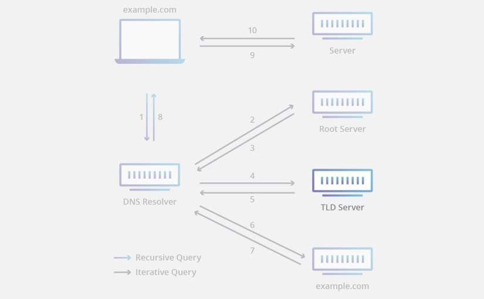

# DNS와 작동 원리

## DNS 

**DNS\(Domain Name System\)**는 특정 컴퓨터 또는 네트워크로 연결된 임의의 장치의 주소를 찾기 위해, 사람이 이해하기 쉬운 도메인 이름을 숫자로 된 IP 주소로 변환해주는 시스템이다. DNS는 흔히 "**전화번호부**"로 비유할 수 있다. 

### 1. DNS의 구성 요소

#### 1\) Domain Name Space

DNS는 거대한 분산 네이밍 시스템이며, "**도메인 네임 스페이스\(domain name space\)**"는 이러한 DNS가 저장/관리하는 계층적 구조를 의미한다.

최상위 Root DNS 서버가 존재하고, 그 하위로 인터넷에 연결된 모든 노드가 연속해서 이어진 계층 구조로 구성되어 있다. 각 레벨\(top level, second level등\)의 도메인은 그 하위 도메인에 관한 정보를 관리하는 구조이다.

#### 2\) Name Server

문자열로 포함된 도메임 이름을 실제 컴퓨터가 통신할 때 사용하는 숫자로 표현된 IP 주소로 변환 시켜주어야 한다. 이러한 동작을 위해서는 도메인 네임 스페이스\(domain name space\)의 트리 구조에 대한 정보가 필요하며, 이러한 정보를 가지고 있는 서버를 "**네임 서버\(name server\)**"라고 한다.

#### 3\) Resolver

리졸버\(resolver\)는 웹 브라우저와 같은 DNS 클라이언트 요청을 네임 서버\(name server\)로 전달하고 네임 서버로 부터 정보\(도메인 이름과 IP 주소\)를 받아 클라이언트에게 제공하는 기능을 수행한다. 이 과정에서 리졸버는 하나의 네임 서버에게 DNS 요청을 전달하고 해당 서버에 정보가 없으면 다른 네임 서버에게 요청을 보낸 정보를 받아 온다.

### 2. DNS 기본 동작 과정

1. Local DNS서버에서 해당 도메인에 대한 정보 요청
2. 해당 정보가 서버에 없기에 Root DNS서버에 다시 질의
3. Root DNS는 해당 정보가 없지만, 해당 도메인의 TLD 서버 \(예: .com\)정보를 반환
4. Local DNS서버는 TLD 서버에 다시 질의
5. TLD서버는 해당 도메인의 네임서버를 반환
6. Local DNS서버는 해당 도메인의 네임서버에 다시 질의
7. Local DNS서버는 해당 도메인의 네임서버에서 받은 정보를 반환 \(그리고 Local DNS서버는 해당 정보를 캐시해둔다.\)
8. 해당 네임서버에서 받은 정보로 접속하려는 서버에 접속할 수 있게 된다.

#### Reference

Domain Name System[ →\(WIKI\)](https://ko.wikipedia.org/wiki/%EB%8F%84%EB%A9%94%EC%9D%B8_%EB%84%A4%EC%9E%84_%EC%8B%9C%EC%8A%A4%ED%85%9C)

What Is DNS? \| How DNS Works [→\(SITE\)](https://www.cloudflare.com/learning/dns/what-is-dns/)

