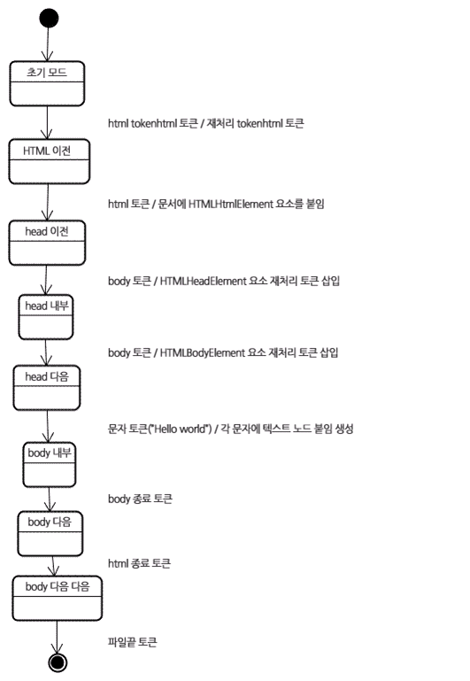

# 브라우저와 동작 원리 \(1\)

### Browser 개요

브라우저\(browser\)의 핵심 기능은 사용자가 보고자 하는 페이지를 서버에 요청하고 서버로 부터 받은 응답을 브라우저에 표시하는 것이다.

### Browser의 기본 구조


* User Interface
  * 사용자가 기능을 쉽게 이용할 수 있도록 만든 UI 요소들
  *  주소 표시줄, 이전/다음 버튼, 북마크 등이 있다.
* Browser Engine
  * UI와 렌더링 엔진\(rendering engine\)사이에서 중간 매체 역할을 수행
* Rendering Engine
  * 웹 서버로 부터 응답 받은 내용은 UI 상에서 나타내주는 렌더링 엔진
  * 사용자 요청해서 웹 서버가 응답한 HTML문서를 HTML과 CSS로 파싱해서 화면을 구성.
* Networking
  * 웹 서버와 통신이 가능하게 하는 네트워크
* UI Backend
  * UI 구동이 가능하게 하는 UI 백엔드
* JavaScript Interpreter
  * JavaScript 코드를 파싱하고 실행하는 자바스크립트 해석기
* DataPersistence
  * 쿠키와 로컬 데이터를 저장하는 데이터 스토리지\(data storage\)로 구성된다.

### Rendering engine

렌더링 엔진의 역할은 요청 받은 내용을 브라우저 화면에 표시하는 일이다.

#### 1\) 렌더징 엔진의 종류

파이어폭스는 모질라에서 직접 만든 게코\(gecko\)엔진을 사용하고 사파리는 웹킷\(webkit\)엔진을 사용한다. 크롬 역시 웹킷 엔진을 사용했으나 2013년도 부터는 Bilnk 라는 웹킷에서 파생된 엔진을 사용하기 시작했다.

웹킷은 최초 리눅스 플랫폼에서 동작하기 위해서 제작된 오픈소스 엔진인데 애플이 맥과 윈도우에서 사파리 브라우저를 지원하기 위해 수정을 가했다.

#### 2\) 동작 과정

렌더링 엔진은 통신으로부터 요청한 문서의 내용을 얻는 것으로 시작하는데 문서의 내용은 보통 8KE 단위로 전송된다.


1. 문서를 파싱한다.

   1-1. HTML 문서를 파싱한다.

   1-2. 외부 CSS 파일과 함께 포함된 스타일 요소도 파싱한다.

2. "콘텐츠 트리" 내부에서 요소를 DOM node로 변환한다.
3. 스타일 정보와 HTML 표시 규칙은 "렌더 트리"라고 부르는 또 다른 트리를 생성한다.

   3-1. 렌더 트리는 색상 또는 면적과 같은 시각적 속성이 있는 사각형을 포함하고 있다.

   3-2. 이는 정해진 순서대로 화면에 표시된다.

4. 렌더 트리 생성이 끝나면 배치가 시작된다. 이것은 각 노드가 화면의 정확한 위치에 표시되는 것을 말한다.

일련의 과정들이 점진적으로 진행된다는 것을 아는 것이 중요하다. 렌더링 엔진은 좀 더 나은 사용자 경험을 위해 가능하면 빠르게 내용을 표시하는데 모든 HTML 파싱할 때 까지 기다리지 않고 배치와 그리기 과정을 시작한다. 네트워크로부터 나머지 내용이 전송되기를 기다리는 동시에 내용의 일부를 먼저 화면에 표시하는 것이다.

#### 3\) 웹킷과 게코의 동작과정


웹킷과 게코는 용어를 약간 다르게 사용하고 있지만 동작 과정은 기본적으로 동일하다는 것으로 위에 그림을 보면 알 수 있다.

|  | 게코\(Gecko\) | 웹킷\(Webkit\) |
| :--- | :--- | :--- |
| 시각적으로 처리되는 렌더 트리 | 형사 트리\(frame tree\) | 렌더 트리\(render tree\) |
| 렌더 트리의 각 요소 | 형상\(frame\) | 렌더 객체\(render object\) |
| 배치 | 리폴로\(reflow\) | 배치\(layout\) |

게코는 HTML과 DOM tree 사이에 **콘텐츠 싱크\(content sink\)**라는 과정을 두는데 이는 DOM 요소를 생성하는 공정으로 웹킷과 비교하여 차이점이라고 보지는 않는다.

### 파싱과 DOM Tree 구축

#### 1\) 일반 파싱

파싱은 렌더링 엔진에서 매우 중요한 과정이기 때문에 더 자세히 다룰 필요가 있다.

문서 파싱은 브라우저가 코드를 이해하고 사용할 수 있는 구조로 변환하는 것을 의미한다. 파싱 결과는 보통 문서 구조를 나타내는 노드 트리인데 파싱 트리\(parse tree\)또는 문법 트리\(syntax tree\)라고 부른다.


#### 2\) 문법

파싱은 문서에 작성된 언어 또는 형식의 규칙을 따르는데 파싱할 수 있는 모든 형식은 정해진 용어와 구문 규칙에 따라야 한다. 이것을 [문맥 자유 문법](https://ko.wikipedia.org/wiki/%EB%AC%B8%EB%A7%A5_%EC%9E%90%EC%9C%A0_%EB%AC%B8%EB%B2%95)이라고 한다. 인간의 언어는 이런 모습과 다르기 때문에 기계적으로 파싱이 불가능하다.

#### 3\) 파서-어휘 분석기 조합

파싱 어휘 분석과 구문 부석으로 구분 할 수 있다.

* 어휘 분석
  * 자료를 토큰으로 분해하는 과정이다. 토큰은 유효하게 구성된 단위의 집합체로 용어집이라고 할 수 있는데 인간의 언어로 말하자면 사전에 등장하는 모든 단어에 해당된다.
* 구문 분석
  * 언어의 구문 규칙을 적용하는 과정이다.

파서는 보통 두 가지 역할을 한다.

* 자료를 유효한 토큰으로 분해하는 어휘 분석기 또는 토큰 변환기\(공백과 줄 바꿈 같은 의미 없는 문자를 제거한다.\)
* 언어 구문 규칙에 따라 문서 구조를 분석함으로써 파싱 트리를 생성하는 파서


 파싱 과정은 반복된다. 파서는 보통 어휘 분석기로부터 새 토큰을 받아서 구문 규칙과 일치하는지 확인한다. 규칙에 맞으면 토큰에 해당하는 노드가 파싱 트리에 추가되고 파서는 또 다른 토큰을 요청한다.

규칙에 맞지 않으면 파서는 토큰을 내부적으로 저장하고 토큰과 일치하는 규칙이 발견될 때까지 요청한다. 맞는 규칙이 없는 경우 예외 처리하는데 이것은 문서가 유효하지 않고 구문 오류를 포함하고 있다는 의미다.

#### 4\) 변환

파서 트리는 최종 결과물이 아니다. 파싱은 보통 문서를 다른 양식으로 변환하는데 컴파일이 하나의 예가 된다. 소스 코드를 기계 코드로 만드는 컴파일러는 파싱 트리 생성 후 이를 기계 코드 문서로 변환한다.


#### 5\) 파서의 종류 

* 하향식 파서
  * 구문의 상위 구조로 부터 일치하는 부분을 찾기 시작한다.
* 상향식 파서
  * 낮은 수준에서 점차 높은 수준으로 찾는다.

예시로, 두 파서를 2 + 3 - 1을 파싱해보자.

하향식 파서는 2 + 3과 같은 표현식에 해당하는 가장 높은 수준의 규칙을 먼저 찾는다. 그 다음 표현식으로 2 + 3 - 1을 찾는다. 표현식을 찾는 과정은 일치하는 다른 규칙을 점진적으로 더 찾아내는 방식인데 어쨌거나 가장 높은 수준의 규칙을 먼저 찾는 것으로부터 시작한다.

상향식 파서는 입력 값이 규칙에 맞을 때 까지 찾아서 맞는 입력 값을 규칙으로 바꾸는데 이 과정은 입력 값의 끝까지 진행한다. 부분적으로만 일치하는 표현은 스택에 쌓아둔다.

| 스택 | 입력 값 |
| :--- | :--- |
|  | 2 + 3 - 1 |
| 항 | + 3 - 1 |
| 항 연산자 | 3 - 1 |
| 표현식 | -1 |
| 표현식 연산자 | 1 |
| 표현 |  |

상향식 파서는 입력의 값의 오른쪽으로 이동하면서\(입력 값의 처음을 가리키는 포인터가 오른쪽으로 이동하는 것을 상상\)구문 규칙으로 갈수록 남는 것이 점차 감소하기 때문에 이동-감소-파소 라고 부른다.

#### 6\) 파서 자동 생성

 파서를 생성해 줄 수 있는 도구를 파서 생성기라고 한다. 언어에 어휘나 구문 규칙 같은 문법을 부여하면 동작하는 파서를 만들어 준다. 파서를 생성하는 것은 파싱에 대한 깊은 이해를 필요로 하고 수동으로 파서를 최적화하여 생성하는 것은 쉬운 일이 아니기 때문에 파서 생성기는 매우 유용하다.

웹킷은 잘 알려진 두 개의 파서 생성기를 사용한다. 어휘 생성을 위한 플렉스\(flex\)와 파서 생성을 위한 바이슨\(bison\)이다. 렉스\(lex\)와 약\(yacc\) 이라는 이름과 함께 들어본 적이 있을지 모르겠다.  플렉스는 토큰의 정규 표현식을 포함하는 파일을 입력 받고 바이슨은 BNF 형식의 언어 구문 규칙을 입력 받는다.

### HTML 파서

HTML 파서는 HTML 마크업 파싱 트리로 변환한다.

#### 1\) HTML 문법

 HTML 어휘와 문법은 W3C에 의해 명세로 정의 되어있다. 

#### 2\) 문맥 자유 문법 아니다.

파싱 일반 소개를 통해 알게 된 것 처럼 문법은 BNF와 같은 형식을 이용하여 공식적으로 정의할 수 있다.

안타깝게도 모든 전통적인 파서는 HTML에 적용이 불가하다. 위에서 소개한 파싱은 CSS 와 JavaScript를 파싱하는데 사용된다. HTML은 파서가 요구하는 문맥 자유 문법에 의해 쉽게 정의할 수 없다.

HTML 정의를 위한 공식적인 형식으로 DTD\(문서 형식 정의\)가 있지만 이것은 문맥 자유 문법이 아니다. 

이것은 언뜻 이상하게 보일 수도 있는데 HTML과 XML과 유사하기 때문이다. 사용할 수 있는 XML 파서가 많다. HTML을 XML 형태로 재구성한 XHTML도 있는데 무엇이 큰 차이점일까?

차이점은 HTML이 더 "너그럽다"는 점이다. HTML은 암묵적으로 태그에 대한 생략이 가능하다. 가끔 시작 또는 종료 태그 등을 생략한다.

#### 3\) DOM

"파싱 트리"는 DOM 요소와 속성 노드의 트리가 된다. DOM은 문서 객체 모델\(document object model\)의 준임말이다. 이것은 HTML 문서의 객체 표현이고 JavaScript와 같은 외부를 향하는 HTML 요소의 연결 지점이다. 트리의 최상위 객체는 문서이다.

DOM은 마크업과 1:1의 관계를 맺는다.

```markup
<!DOCTYPE html>
<html lang="en">
<head>
	<meta charset="UTF-8">
	<meta name="viewport" content="width=device-width, initial-scale=1.0">
	<title>Document</title>
</head>
<body>
	<div class="box">box</div>
</body>
</html>
```

이것은 아래와 같은 DOM 트리로 변환할 수 있다.


트리가 DOM 노드를 포함한다고 말하는 것은 DOM 접점의 하나를 실행하는 요소를 구성한다는 의미이다. 브라우저는 내부의 다른 속성들을 이용하여 이를 구체적으로 실행한다.

#### 4\) 파싱 알고리즘

앞서 말한대로 HTML은 일반적인 하향식 또는 상향식 파서로 파싱이 안되는데 그 이유는 다음과 같다.

1. 언어의 너그러운 속성.
2. 잘 알려져 있는 HTML 오류에 대한 브라우저의 관용.
3. 변경에 의한 재파싱. 일반적으로 소스는 파싱하는 동안 변하지 않지만 HTML에서 `document.write`을 포함하고 있는 스크립트 태그는 토큰을 추가할 수 있기 때문에 실제로는 입력 과정에 파싱이 수정된다.

일반적인 파싱 기술을 사용할 수 없기 때문에 브라우저는 HTML 파싱을 별도의 파서를 생성한다.

파싱 알고리즘은 HTML 자세히 설명되어 있다. 알고리즘은 토큰화와 트리 구축 이렇게 두 단계로 되어 있다. 토큰화는 어휘 분석으로서 입력 값을 토큰으로 파싱한다. HTML에서 토큰은 시작 태그, 종료 태그, 속성 이름과 속성 값이다. 

토큰화는 토큰을 인지해서 트리 생성자로 넘기고 다른 토크를 확인하기 위해 다음 문자를 확인한다. 그리고 입력의 마지막까지 이 과정을 반복한다.


#### 5\) 토큰화 알고리즘

알고리즘의 결과물은 HTML 토큰이다. 알고리즘은 기계 상태\(state machine\)라고 볼 수 있다. 각 상태는 하나의 연속된 문자를 입력받아 이 문자에 따라 다음 상태를 갱신한다. 그러나 결과는 현재의 토큰화 상태와 트리 구축 상태의 영향을 받는데. 이것은 같은 문자를 읽어 들여도 현재 상태에 따라 다음 상태의 결과가 다르게 나온다는 것을 의미한다.

다음은 HTML 토큰화를 설명하기 위한 기본적인 예제이다.

```markup
<html>
    <body>
        box
    </body>
</html>
```

1. 초기 상태는 "**자료 상태**"이다.
2. `<` 문자를 만나면 상태는 "**태그 열림 상태**"로 변한다.
3. a-z의 문자를 만나면 "시작 태그 토큰"을 생성하고 상태는 "**태그 이름 상태"**로 변하는데 이 상태는`>`문자를 만날 때 까지만 유지된다. 각 문자에는 새로운 토근 이름이 붙는데 이 경우 생성된 토큰은 html 토큰이다.
4. `>` 문자를 만나면 토큰이 발행되고 상태는 "**자료 상태**"로 변한다.
5. 태그는 동일한 절차에 따라 처리된다.
6. body 태그 발행
7. box의 b문자를 만나면 문자 토큰이 생성되고 발행될 것이다. 이는 종료 태그의 `<`문자를 만날때 까지 진행 된다.  box의 각 문자를 위한 문자 토큰을 발행할 것이다.
8. 다시 "**태그 열림 상태**"가 되었다. / 문자는 종료 태그 토큰을 생성하고 "**태그 이름 상태**"로 변경될 것이다. 이 상태는 &gt; 문자를 만날 때까지 유지된다. 그리고 새로운 태그 토큰이 발행되고 다시 "**자료 상태**"가 된다. 이 과정이 파일 끝까지 계속 반복될 것이다.


#### 6\) 트리 구축 알고리즘

파서가 생성되면 문서 객체가 생성된다. 트리 구축이 진행되는 동안 문서 최상단에서 DOM 트리가 수정되고 요소가 추가된다. 토큰화에 의해 발행된 각 노드는 트리 생성자에 의해 처리된다. 각 토큰을 위한 DOM 요소의 명세는 정의되어있다. DOM 트리에 요소를 추가하는 것이 아니라면 열린 요소는 스택에 추가된다. 이 스택은 부정확한 중첩과 종료되지 않은 태그를 교정한다. 알고리즘은 상태 기계라고 설명할 수 있고 상태는 "삽입 모드"라고 부른다.

아래 입력 예제의 트리 생성 과정을 보자.

```markup
<html>
    <body>
        box
    </body>
</html>
```

트리 구축 단계에서 입력 값은 토큰화 단계에서 만들어지는 일련의 토큰이다.

1. 받은 html 토큰은 **"html 이전"** 모드가 되고 토큰은 이 모드에서 처리된다. 이것은 HTML head element 요소를 생성하고 문서 객체의 최상단에 추가된다.
2. 상태는 **"head 이전"** 모드로 바뀌었고 **"body" 토큰을 받았다!** "head" 토큰이 없더라도 HTML head element 는 묵시적으로 생성되어 트리에 추가될 것이다. HTML의 관용?
3. 곧이어 **"head 안쪽"** 모드로 이동했고 다음은 **"head 다음"** 모드로 간다. body 토큰이 처리 되었고 HTMLBodyElement 가 생성되어 추가됐으며 **"body 안쪽"**모드가 되었다.
4. "box" 문자열의 문자 토큰을 받았다. 첫번째 토큰이 생성되고 "본문" 노드가 추가되면서 다른 문자들이 그 노드에 추가될 것이다.
5. body 종료 토큰을 받으면 **"body 다음"** 모드가 된다. html 종료 태그를 만나면 "body 다음 다음"모드로 바뀐다. 파일 끝 토큰을 받으면 파싱을 종료한다.



#### 7\) 파싱 끝난 이후의 동작

이번 단계에서 브라우저는 문서와 상호작용할 수 있게 되고 문서 파싱 이후에 실행되어야 하는 **"지연" 모드 스크립트**를 파싱하기 시작한다. 문서 상태는 "**완료**"가 되고 "**로드**"이벤트가 발생한다. 

#### 8\) 브라우저의 오류 처리

H TML 페이지에서 "유효하지 않은 구문"이라는 오류를 본 적이 없을 것이다. 이는 브라우저가 모든 오류 구문을 교정하기 때문에 아래 오류가 포함된 HTML 예제를 보자.


```markup
<html>  
   <mytag></mytag>
   <div>
     <p>
   </div>
   Really lousy HTML
   </p>
</html>
```


위의 예제와 같이 규칙에 어긋난 HTML 브라우저는 투덜거리지 않고 올바르게 표시하는데 이는 파서가 HTML 작성자의 실수를 수정했기 때문이다.

이런 오류 처리 형태는 브라우저에서 꽤나 일반적임에도 불구하고 HTML의 현재 명세가 아니라는 점이 놀라울 뿐이다. 북마크와 이전/다음 버튼 처럼 수 년간 브라우저 안에서 구현된 것이다. 잘 알려진 HTML 오류를 많은 사이트에서 발견할 수 있지만 브라우저는 다른 브라우저들이 했던것처럼 관습적으로 오류를 고치고 있다.

HTML5 명세는 이런 요구 사항 일부 정의 했다. 웹킷은 HTML 파서 클래스의 시작 부분에 주석으로 잘 요약해두었다. 

파서는 토큰화된 입력 값을 파싱하여 문서를 만들고 문서 트리를 생성한다. 규칙에 맞게 잘 작성된 문서라면 파싱이 수월하겠지만 그렇지 않은 경우의 문서또한 많이 다뤄야 하기 때문에 파서는 오류에 대한 아량이 있어야 한다.

파서는 적어도 다음과 같은 오류를 처리해야 한다.

1. 어떤 태그의 안쪽에 추가하려는 태그가 금지된 것일 때 일단 허용된 태그를 먼저 닫고 금지된 태그는 외부에 추가한다.
2. 파서가 직접 요소를 추가해서는 안된다. 문서 제작자에 의해 뒤늦게 요소가 추가될 수 있고 생략 가능한 경우도 있다. HTML, HEAD, BODY, TBODY, TR, TD, LI 태그가 이런 경우에 해당한다.
3. 인라인 요소 안쪽에 블록 요소가 있는 경우 부모 블록 요소를 만날 때까지 모든 인라인 태그를 닫는다.
4. 이런 방법이 도움이 되지 않으면 태그를 추가하거나 무시할 수 있는 상태가 될 때까지 요소를 닫는다.

웹킷이 오류를 처리하는 예는 다음과 같다.

어떤 사이트는 `<br>대신</br>`을 사용한다. IE, 파이어폭스와 호환성을 갖기 위해 웹킷은 이것을 `<br>`로 간주한다.


```javascript
if(t->isCloseTag(brTag) && m_document->inCompatMode()) {  
    reportError(MalformedBRError);
    t->beginTag = true;
}
```



```markup
<table>

    <table>

    <tr><td>inner table</td></tr>

    </table>

    <tr><td>outer table</td></tr>

</table>  

```



```markup
<table>

    <tr><td>outer table</td></tr>

</table>

<table>

    <tr><td>inner table</td></tr>

</table>  
```


웹킷은 이런 오류를 처리하는데 스택을 사용한다. 안쪽의 표는 바깥쪽 표의 옮겨져서 형제 요소가 된다.

#### 중첩된 폼 요소

폼 안에 또 다른 폼을 넣을 경우 안쪽의 폼은 무시된다. 

```javascript
if(!m_currentFormElement) {  
    m_currentFormElement = new HTMLFormElement(formTag, m_document);
}
```

#### 태그 중첩이 너무 깊을 때

 [www.liceo.edu.mx](http://www.liceo.edu.mx/) 사이트는 약 1,500개 수준의 태그 중첩이 되어있는 예제인데 모든 요소가 &lt;b&gt;로 되어있다. 최대 20개의 중첩만 허용하고 나머지는 무시한다.

```javascript
bool HTMLParser::allowNestedRedundantTag(const AtomicString& tagName)
{
	unsigned i = 0;
	for(HTMLStackElem* curr = m_blockStack;
		i < cMaxRedundantTagDepth && curr && curr->tagName == tagName;
		curr = curr->next, i++){}
	return i != cMaxRedundantTagDepth;
}
```

#### 잘못 닫힌 html 또는 body 태그

깨진 html을 지원한다. 일부 바보같은 페이지는 문서가 끝나기 전에 body를 닫아버리기 때문에 브라우저는 body 태그를 닫지 않는다. 대신 종료를 위해 end\(\)를 호출한다.

```javascript
if(t->tagName == htmlTag || t->tagName == bodyTag)
	return;
```

#### Reference

How Browset Work [→\(SITE\)](https://www.html5rocks.com/en/tutorials/internals/howbrowserswork/)

