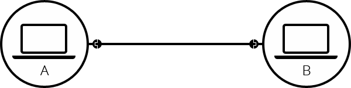
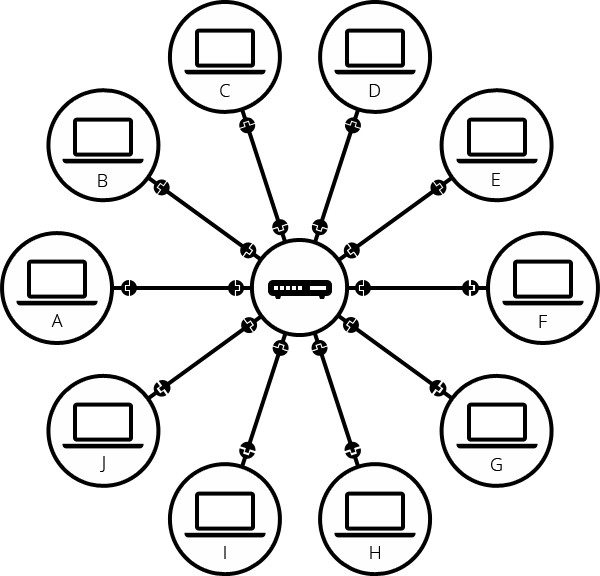

# 인터넷 통신 원리

##   인터넷\(Internet\) 

인터넷은 웹의 핵심적인 기술로써 **컴퓨터를 서로 연결하여 TCP/IP라는 통신 프로트콜을 이용해 정보를 주고 받는 컴퓨터 네트워크** 이다.

### 1. 인터넷의 변화

#### 1\) 단순한 네트워크

#### **① 1:1 연결**

두 대의 컴퓨터가 통신이 필요할 때, 우리는 다른 컴퓨터와 물리적\(케이블/랜선\)으로 또는 무선으로 WiFi, Bluetooth에 연결 되어야 한다. 모든 현대 컴퓨터들은 이러한 연결 중 하나를 이용하여 연결을 지속할 수 있다.

#### **② N:M 연결**

우리는 1:1로 연결하는 방식과 같은 방식으로 원하는 만큼 컴퓨터를 연결할 수 있다. 하지만 이렇게 연결할 경우 컴퓨터의 수가 늘어날 수록 매우 복잡해진다.

이 경우 컴퓨터마다 9개의 플러그가 필요하고, 45개의 케이블이 필요하다.

#### **③ 라우터 연결**

위에 문제를 해결하기 위해 네트워크의 각 **컴퓨터는 라우터\(router\)라는 특수한 소형 컴퓨터**에 연결된다. 라우터는 단 하나의 작업만 있다. 철도역의 신호원처럼 **주어진 컴퓨터에서 보낸 메세지가 올바른 대상 컴퓨터에 도착하는지 확인**하는 것이다. 예를 들면 컴퓨터 B에게 메시지를 보내려면 컴퓨터 A가 메시지를 라우터로 보내야하며, 라우터는 메시지를 컴퓨터 B로 전달하고 메시지가 컴퓨터 C로 전달되지 않도록 해야 한다.

위의 그림과 같이 라우터를 시스템에 추가하면 10대의 컴퓨터 네트워크에는 10개의 케이블만 필요하다. 각 컴퓨터마다 단일 플러그와 10개의 플러그가 있는 하나의 라우터만 필요하게 된다.

#### 2\) 네트워크 속의 네트워크

그렇다면 수 백, 수 천, 수 십억 대의 컴퓨터를 연결하려면 그만큼의 플러그가 필요하고 모든 컴퓨터가 연결 되어야 할까? 일단, 라우터 자체로도 그 정도까지 확장할 수 없다. 그렇다면 어떻게 해야될까?

앞서 라우터 또한 '컴퓨터'라고 했었다. 따라서 두 대 이상의 라우터도 연결할 수 있다. 아래의 그림은 각각의 라우터로 연결된 두 개의 네트워크를 연결한 모습이다.

즉, 컴퓨터를 라우터에 연결하고, 라우터에서 라우터로 연결함으로써 연결을 무한히 확장할 수 있다.

이러한 네트워크는 우리가 **인터넷**이라고 부르는 것에 매우 가까워졌다. 상대적으로 많은 컴퓨터를 적은 케이블로 연결할 수 있어졌다. 하지만 아직까지 우리에게는 물리적 한계가 존재한다. 예를 들어 아주 먼 곳까지, 수 십개의 라우터를 유선 케이블로 없을 것이다. 그렇다면 이 문제를 어떻게 해결할 수 있을까?

우리는 이미 집집마다 연결된 케이블이 있다. 바로'전화선'이다. 전화선을 통해 장거리 네트워크에 연결하기로 했다. 우리 네트워크와 전화 시설을 연결하기 위해선 **모뎀\(modem\)**이라는 특수 장비가 필요하다.

> 모뎀은 우리 네트워크 정보를 전화 시설에서 처리할 수 있는 정보로 바꾸며, 그 반대의 경우도 마찬가지다.

모뎀을 통해 우리의 네트워크는 전화 시설에 연결된다. 하지만 우리의 컴퓨터가 보낸 메시지가 도달해야 할 컴퓨터\(혹은 네트워크\)까지 도달하지 않은 상태다. 이 메세지가 전달되려면 **인터넷 서비스 제공 업체\(Inter Service Provider\)**에 연결되어야 한다.

> ISP는 모두 함께 연결되는 몇몇 특수한 라우터를 관리하고, 다른 ISP 라우터에도 엑세스 할 수 있는 회사이다. 예를 들면 LGU, SKT 등이 있다.

따라서 우리의 네트워크 메시지 ISP 네트워크의 네트워크를 통해 대상 네트워크로 전달된다. 인터넷은 아래 그림과 같이 이러한 전체 네트워크 인프라도 구성된다.

####  Reference

How does the Internet work [→\(MDN\)](https://developer.mozilla.org/en-US/docs/Learn/Common_questions/How_does_the_Internet_work)

