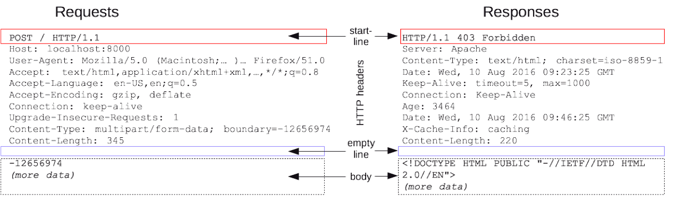
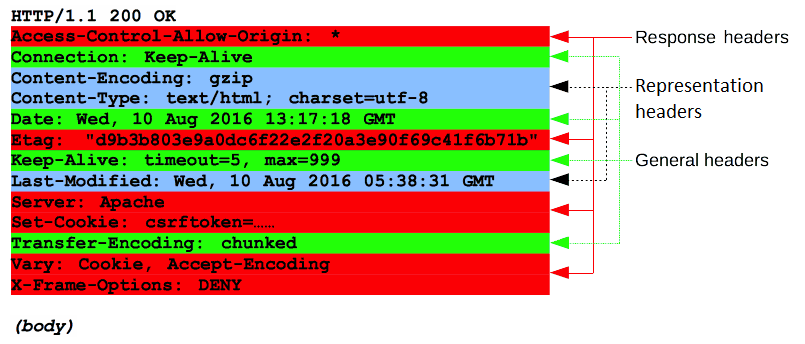

# What is HTTP ?

### HTTP 개요

HTTP는[ **H**yer**T**ext **T**ransfer **P**rotocol](https://ko.wikipedia.org/wiki/HTTP)의 약자로 하이퍼텍스트 문서를 교환하기 위하여 사용된 통신 규약이다. 즉, 웹 **서버와 클라이언트 간의 통신하기 위한 통신 규약** 이다.

HTTP는 웹에서만 사용 프로트콜로 TCP/IP 기반으로 한 지점에서 다른 지점\(서버와 클라이언트\)으로 요청과 응답을 전송한다.

### HTTP 특징

* HTTP 메시지는 HTTP 서버와 HTTP 클라이언트에 의해서 해석이 된다.
* TCP/IP를 이용하는 [응용 프로토콜\(application protocol\) ](https://ko.wikipedia.org/wiki/%EC%9D%91%EC%9A%A9_%EA%B3%84%EC%B8%B5)이다.
* HTTP는 연결 상태를 유지하지 않는 비연결 프로트콜 이므로 이러한 단점을 해결하기 위해서 Cookie와 Session이 등장하게 된다.
* HTTP는 연결을 유지하지 않는 프로토콜 이기 때문에 요청\(request\)/응답\(response\)방식으로 동작한다.

### **HTTP Request**

**클라이언트가 서버에게 연락하는 것을 요청\(request\)이라고 하며, 요청을 보낼 때에는 요청에 대한 정보를 담아 서버로 보낸다.**

#### 1\) HTTP Request Message

#### header

* 첫 번째 줄\(start line\)
  * 요청 메서드 + 요청 URL + HTTP 프로트콜 버전
  * `GET / background.png HTTP/1.0`
  * `POST / HTTP 1.1`
* 두 번째 줄1\(http headers\)
  * header의 정보들로 heder name : header value의 형태
  * 각각의 줄은 Line Feed\(LF\)와 Carriage Return\(CR\)으로 구분된다.
* 빈 줄\(empty line\)
  * 요청에 대한 모든 메타 정보가 전송되었음을 알린다.
* body
  * `POST, PUT`의 경우에만 존재
  * 요청과 관련된 내용

#### 2\) HTTP Request Method

| method | description |
| :--- | :--- |
| GET | 자료를 요청할 때 사용 |
| POST | 자료의 생성을 요청할 때 사용 |
| PUT | 자료의 수정을 요청할 때 사용 |
| DELETE | 자료의 삭제를 요청할 때 사용 |

### HTTP Response

**서버가 요청에 대한 답변을 클라이언트에게 보내는 것**을 **응답\(reponse\)**이라고 한다.

#### 1\) HTTP Response Message

header

* 첫 번째 줄\(status line\)
  * HTTP 프로트콜 버전 + 응답 코드 + 응답 메시지
  * `HTTP/1.1 404 Not Found.`
* 두 번째 줄\(http headers\)
  * header의 정보들로 heder name : header value의 형태
  * 날짜, 웹 서버 이름, 웹 서버 버전, 콘텐츠 타입, 콘텐츠 길이, 캐시 제어 방식 등
  * 각각의 줄은 Line Feed\(LF\)와 Carriage Return\(CR\)으로 구분된다.
* 빈 줄\(empty line\)
  * 요청에 대한 모든 메타 정보가 전송되었음을 알린다.
* body
  * 실제 응답 리소스 데이터
  * 201, 204dhk 같은 상태 코드\(status code\) 가진 응답에는 보통 body가 존재하지 않는다.

### HTTP Status Code

상태 코드\(status code\)는 모두 셋자리 숫자로 이루어져 있으며, 아래와 같이 크게 다섯 분류로 나눌 수 있다.

| status code | message | description |
| :--- | :--- | :--- |
| 1XX | infomation | 조건부 응답으로 요청을 받았으며 작업을 계속한다. |
| 2XX | successful | 클라이언트가 요청한 동작을 수신하여 이해했고 성공적으로 처리했음을 가리킨다. |
| 3XX | redirection | 클라이언트는 요청을 마치기 위해 추가 동작을 취해야 한다. |
| 4XX | client error | 클라이언트에 오류가 있음을 나타낸다. |
| 5XX | server error | 서버가 유효한 명백하게 수행하지 못했음을 나타낸다. |

####  Reference

An overview of HTTP [→\(MDN\)](https://developer.mozilla.org/en-US/docs/Web/HTTP/Overview)

HTTP request methods [→\(MDN\)](https://developer.mozilla.org/en-US/docs/Web/HTTP/Methods)

